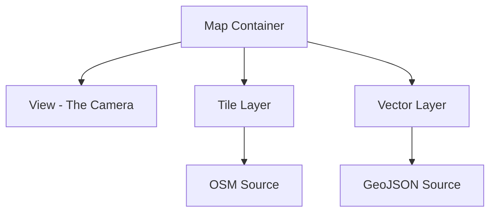

# Module 1 - OpenLayers Fundamentals & Architecture

**Time:** 09:00–09:45 (Extended to 60 mins)

Welcome to the first module! Here we will build a solid foundation by understanding the core architectural concepts of OpenLayers. This module provides the essential theory and practical starting points required for all subsequent sessions.

---

## 1. The Core Architecture: Map, View, Layer, and Source

To build any Web GIS application using OpenLayers, you must understand its four primary building blocks. OpenLayers strictly separates the **DOM container**, the **camera**, the **visual representation**, and the **data retrieval** mechanisms.



### 1.1 The `Map` Object
The `Map` is the core component. It requires a target DOM element (an HTML `div`) to render into. By itself, a map does nothing; it acts as a manager that orchestrates the layers, view, controls, and interactions.

### 1.2 The `View` Object
The `View` controls the 2D "camera" looking down at your data. 
- **Center:** Where the camera is looking.
- **Zoom/Resolution:** How close the camera is to the ground.
- **Projection:** The coordinate system the camera uses to interpret the world.

### 1.3 `Layer` vs `Source`
One of the most important concepts in OpenLayers is the separation of data and rendering:
- **Source:** Responsible for fetching the data. For example, `ol/source/OSM` fetches PNG tiles from OpenStreetMap servers. `ol/source/Vector` fetches GeoJSON data.
- **Layer:** Responsible for rendering the data provided by the source. A `TileLayer` renders images on a grid, while a `VectorLayer` renders mathematically defined shapes using canvas drawing instructions.

---

## 2. Setting Up Your First Map

Let's look at the absolute minimum code required to render a map on the screen.

```javascript
import Map from 'ol/Map.js';
import View from 'ol/View.js';
import TileLayer from 'ol/layer/Tile.js';
import OSM from 'ol/source/OSM.js';

// 1. Initialize the Map
const map = new Map({
  target: 'map-container', // The ID of your HTML div
  
  // 2. Add Layers (and Sources)
  layers: [
    new TileLayer({
      source: new OSM() // OpenStreetMap Tile Source
    })
  ],
  
  // 3. Define the View
  view: new View({
    center: [0, 0], // Coordinates in EPSG:3857 (Web Mercator)
    zoom: 2         // Initial zoom level (0 is whole world)
  })
});
```

---

## 3. Deep Dive: Projections and Coordinate Transformations

By default, OpenLayers uses **Web Mercator (`EPSG:3857`)**, which is the standard for web mapping (used by Google Maps, OSM, etc.). Its coordinates are in meters. However, most GPS data, datasets, and human-readable coordinates are in **WGS84 (`EPSG:4326`)** (Longitude/Latitude in degrees).

If you try to pass `[Longitude, Latitude]` directly into a view center without transforming it, the map will look at a location 0 meters from the equator, which is in the ocean off the coast of Africa!

### Transforming Coordinates
OpenLayers provides a utility function `fromLonLat` to easily handle this.

```javascript
import { fromLonLat, transform } from 'ol/proj.js';

// Simple helper for WGS84 -> Web Mercator
const tokyoCenter = fromLonLat([139.6917, 35.6895]);

// Generic transform function for any projection
const customCenter = transform([139.6917, 35.6895], 'EPSG:4326', 'EPSG:3857');

map.getView().setCenter(tokyoCenter);
```

---

## 4. Advanced View Constraints

In production applications, you rarely want users to zoom out infinitely or pan into the grey void outside the map data. The `View` object accepts several constraint properties.

### Limiting Zoom and Extent
```javascript
const view = new View({
  center: fromLonLat([2.3522, 48.8566]), // Paris
  zoom: 12,
  minZoom: 10,        // Prevent zooming out too far
  maxZoom: 18,        // Prevent zooming in too close
  extent: [           // Restrict panning to a specific bounding box (in EPSG:3857)
    251000, 6230000,
    275000, 6260000 
  ]
});
```

---

## 5. Controls and Interactions

While the `Map`, `View`, and `Layers` handle the visual aspects, OpenLayers uses two distinct concepts for user input:

- **Controls:** UI elements rendered on top of the map (e.g., Zoom buttons, Scale line, Attribution). Controls typically handle simple click events.
- **Interactions:** Invisible logic that handles mouse, touch, and keyboard events on the map canvas (e.g., Dragging the map, Mouse wheel zoom, Pinch-to-zoom).

By default, OpenLayers adds a standard set of both. You can customize them during initialization:

```javascript
import { defaults as defaultControls, ScaleLine } from 'ol/control.js';
import { defaults as defaultInteractions, DragRotateAndZoom } from 'ol/interaction.js';

const map = new Map({
  target: 'map-container',
  controls: defaultControls().extend([
    new ScaleLine() // Adds a scale bar to the map
  ]),
  interactions: defaultInteractions().extend([
    new DragRotateAndZoom() // Allows holding Shift to rotate the map
  ]),
  // ... layers and view
});
```

---

## 6. Managing Layer Stacking (Z-Index)

As you add more layers, the order they are defined in the `layers` array dictates their rendering order (bottom to top). However, you can explicitly control this using the `setZIndex` method.

```javascript
const baseLayer = new TileLayer({ ... }); // Renders first
const roadLayer = new TileLayer({ ... }); // Renders on top of baseLayer

roadLayer.setZIndex(10); // Forces roadLayer to render above layers with lower z-index
```

---

### Reference resources

- **OpenLayers Concepts:** [https://openlayers.org/doc/tutorials/concepts.html](https://openlayers.org/doc/tutorials/concepts.html)
- **OpenLayers API Documentation:** [https://openlayers.org/en/latest/apidoc/](https://openlayers.org/en/latest/apidoc/)

### Practical activity (30 Minutes)

**Your Task:**

1. **Initialize the Project:** Create a basic HTML file with a `<div id="map" style="width: 100%; height: 500px;"></div>`.
2. **Render the Base Map:** Implement the JavaScript code provided above to render an OSM map.
3. **Navigate the View:** Use `fromLonLat` to center the map on your hometown with a zoom level of `14`.
4. **Apply Constraints:** Add `minZoom` (10) and `maxZoom` (18) properties to your View. Test the mouse wheel zoom to ensure the constraints are working.
5. **Add a Control:** Import and add the `ScaleLine` control to your map so users can see the physical scale.
6. **(Bonus) Read the Docs:** Go to the OpenLayers API docs, find the `FullScreen` control, and add it to your map alongside the scale line.