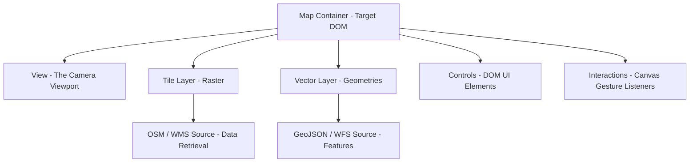

# Module 1 - OpenLayers Fundamentals & Architecture

Welcome to **Module 1**! In this module, we establish the foundation for modern Web GIS engineering by exploring the core architecture of OpenLayers. You will master the relationships between the map container, the camera view, visual layers, data sources, user interactions, and coordinate reference systems.

---

## 1. Introduction to OpenLayers

### 1.1 What is OpenLayers?
**OpenLayers** is a high-performance, open-source JavaScript library for loading, displaying, and interacting with dynamic geospatial data in web browsers. Released under the permissive **2-Clause BSD License**, it allows developers to build rich, interactive GIS applications without proprietary licensing costs or vendor lock-in.

### 1.2 OpenLayers in the Modern Web GIS Ecosystem
In enterprise Web GIS, mapping libraries generally fall into distinct architectural categories:

| Feature / Library | OpenLayers | Leaflet | Mapbox GL JS / MapLibre |
|---|---|---|---|
| **Primary Rendering** | HTML5 Canvas & WebGL | HTML DOM & Canvas | WebGL Vector Tile Shaders |
| **Projections Support** | **Unmatched (any EPSG via Proj4js)** | Basic (3857 / 4326 out of the box) | Restricted (primarily 3857 / Mercator) |
| **OGC Standards** | **Native WMS, WFS, WMTS, OGC API** | Plugin-dependent | Vector Tiles / Raster Tiles |
| **Data Format Support** | GeoJSON, KML, GML, MVT, TopoJSON, GeoTIFF | GeoJSON (plugins for others) | GeoJSON, MVT |
| **Architecture** | Component-based, modular ES modules | Lightweight, plugin-centric | Style-spec driven |
| **Best Used For** | **Enterprise GIS, complex portals, reprojection** | Lightweight consumer maps | Styled vector tile experiences |

### 1.3 Why Use OpenLayers?
- **Complete Coordinate Independence:** Unlike libraries that enforce Web Mercator globally, OpenLayers natively reprojects raster tiles and vector geometries between arbitrary coordinate reference systems on the fly.
- **Enterprise Protocol Native:** Direct support for OGC web services (WMS, WMTS, WFS), GeoTIFFs (via WebGL), and Mapbox Vector Tiles (MVT).
- **Modern ES Module Architecture:** Tree-shakeable design ensures applications bundle only the classes they actually import, keeping production bundle sizes minimal.
- **Extensible Interaction Model:** Sophisticated gesture, snapping, drawing, and modification pipelines built directly into the engine.

### 1.4 Common Web GIS Use Cases
- **Municipal & Cadastral GIS:** Viewing property parcels, land records, zoning boundaries, and ownership deeds.
- **Utility Networks:** Inspecting underground water pipelines, electric transmission grids, and fiber optic assets.
- **Logistics & Fleet Tracking:** Real-time tracking of commercial vehicles, shipping containers, and transport routes.
- **Environmental Dashboards:** Overlaying dynamic satellite imagery, weather radar, flood risk inundation, and air quality metrics.

---

## 2. The Core Architecture: Map, View, Layer, Source, Control, and Interaction

To build scalable applications, OpenLayers strictly separates the **DOM container**, the **camera viewport**, the **rendering mechanism**, the **data retrieval pipeline**, and the **user input handlers**.



### The Six Core Components:
1. **`Map` (`ol/Map`):** The central orchestrator. Binds to a specific HTML `<div>`, coordinates rendering passes, and manages layers, controls, and interactions.
2. **`View` (`ol/View`):** The 2D "camera" looking down at the earth. Determines where the map is centered, the current zoom level, the resolution, and the active projection.
3. **`Layer` (`ol/layer`):** Defines **how** geospatial data is visually composited onto the canvas (e.g., raster image tiles, vector paths, or WebGL textures).
4. **`Source` (`ol/source`):** Defines **where and how** data is retrieved (e.g., requesting PNG tiles from OpenStreetMap, fetching WMS images from GeoServer, or parsing GeoJSON).
5. **`Control` (`ol/control`):** Visible HTML DOM elements overlaid on the map canvas (zoom buttons, attribution badges, scale bars, fullscreen buttons).
6. **`Interaction` (`ol/interaction`):** Invisible event listeners that intercept pointer, touch, and mouse gestures on the canvas (panning, pinch-to-zoom, click selection, vector drawing).

---

## 3. Map vs View & Layer vs Source

Understanding the separation of responsibilities between these four foundational classes is the key to mastering OpenLayers.

### 3.1 `Map` vs `View`

```text
Map (The Orchestrator)               View (The Camera)
 ├── DOM Element Target               ├── Center Coordinate [X, Y]
 ├── Layer Array [L1, L2, L3]         ├── Zoom Level / Resolution
 ├── Controls Collection              ├── Rotation (radians)
 └── Interactions Collection          └── Projection (e.g., EPSG:3857)
```

- **The `Map` (Container & Orchestrator):**
  - Binds directly to an HTML element via `target: 'map'`.
  - Manages the rendering cycle and dispatches map-level DOM events (`pointermove`, `singleclick`, `movestart`, `moveend`).
  - *The Map itself has no concept of geographic coordinates or zoom levels; it delegates all spatial positioning to the View.*
- **The `View` (The Camera):**
  - Governs spatial extent, camera altitude (zoom/resolution), and rotation angle.
  - Can be swapped dynamically at runtime (e.g., switching between different projections).
  - Multiple maps can share the exact same `View` instance, creating synchronized split-screen views.

#### The Relationship Between Zoom and Resolution
In OpenLayers, map scale is governed by **Resolution** (defined as ground meters per display pixel). 

In the standard Web Mercator (`EPSG:3857`) projection at the equator:
$$\text{Resolution} = \frac{2 \cdot \pi \cdot 6378137 \cdot \cos(\text{latitude})}{256 \cdot 2^{\text{zoom}}}$$

- At **Zoom 0**, the entire circumference of the Earth (~40,075 km) is rendered in a single 256x256 pixel tile ($\approx 156,543\text{ meters/pixel}$).
- With each increment in zoom level ($z+1$), resolution is cut exactly in half, doubling map detail in both dimensions.

```javascript
import Map from 'ol/Map.js';
import View from 'ol/View.js';

const map = new Map({
  target: 'map',
  view: new View({
    center: [0, 0], // Center coordinate in Web Mercator meters
    zoom: 2         // Initial zoom scale
  })
});
```

---

### 3.2 `Layer` vs `Source`

OpenLayers enforces a strict boundary between **data retrieval** and **graphical rendering**:

```text
Source (Data Acquisition) ──[Provides Data]──▶ Layer (Visual Representation)
(Network URLs, Parsers, Cache)                  (Canvas, Opacity, Z-Index, Blend Modes)
```

- **`Source` (`ol/source`):** Responsible for fetching raw data from networks, memory, or disk. It knows tile grid coordinate math `[z, x, y]`, OGC parameter formatting, and file parsers (GeoJSON, KML, MVT). It has no knowledge of how pixels or lines are drawn.
- **`Layer` (`ol/layer`):** Responsible for rendering data received from a source onto the browser canvas. It governs presentation properties like `opacity`, `visible`, `zIndex`, `minResolution`, and `maxResolution`.

#### Why Separate Layer and Source?
1. **Reusability:** A single vector source loaded once into browser memory can be rendered across multiple distinct layers with different styling rules or resolution thresholds.
2. **Decoupled Caching:** The source manages tile caching, retry policies, and worker threads without being destroyed if the layer's visibility is toggled off.

#### Core Layer Hierarchy:
- **`TileLayer` (`ol/layer/Tile`):** Renders pre-rendered raster imagery organized in regular square grid pyramids (e.g., OpenStreetMap, Google Maps, Bing, WMTS). Extremely fast and memory-efficient.
- **`ImageLayer` (`ol/layer/Image`):** Renders a single, dynamic raster image generated on demand by a map server (e.g., GeoServer WMS) sized exactly to the current browser viewport.
- **`VectorLayer` (`ol/layer/Vector`):** Renders client-side geometric primitives (points, lines, polygons) dynamically onto the HTML5 Canvas. Supports full attribute inspection, client-side styling, and vector interactions.
- **`VectorTileLayer` (`ol/layer/VectorTile`):** Renders tiled vector geometries (MVT/PBF). Combines the bandwidth efficiency of tile pyramids with the visual sharpness and client-side styling of vector data.
- **`WebGLTileLayer` (`ol/layer/WebGLTile`):** Hardware-accelerated tile renderer optimized for Cloud-Optimized GeoTIFFs (COG) and dynamic multi-band raster analysis.

```javascript
import TileLayer from 'ol/layer/Tile.js';
import OSM from 'ol/source/OSM.js';
import VectorLayer from 'ol/layer/Vector.js';
import VectorSource from 'ol/source/Vector.js';

// TileLayer: Raster imagery tiles
const baseTileLayer = new TileLayer({
  source: new OSM(),
  opacity: 1.0,
  zIndex: 0
});

// VectorLayer: Client-side vector geometries
const operationalVectorLayer = new VectorLayer({
  source: new VectorSource(),
  zIndex: 1
});
```

---

## 4. Environment Setup & Integration Methods

OpenLayers is packaged as a standard ES module and integrates cleanly into modern frontend toolchains.

| Method | Best For | Technical Characteristics |
|---|---|---|
| **Vite + npm** *(Recommended)* | Modern web apps, production, training | Full ES module import, tree-shaking, lightning-fast HMR |
| **CDN / Vanilla JS** | Quick prototypes, static HTML demos | Single monolithic bundle via `<script>`, global `ol` namespace |
| **React / Next.js** | Component-driven single page apps | Bound to a `useRef` container inside `useEffect` with cleanup |
| **Vue / Angular** | Enterprise frontend frameworks | Bound to template reference within component lifecycle hooks |

### 4.1 Vanilla JS (Browser Script Tag)
For quick demonstrations without a build step, load OpenLayers via CDN using the global `ol` namespace:

```html
<!DOCTYPE html>
<html>
  <head>
    <script src="https://cdn.jsdelivr.net/npm/ol@v8.2.0/dist/ol.js"></script>
    <link rel="stylesheet" href="https://cdn.jsdelivr.net/npm/ol@v8.2.0/ol.css">
  </head>
  <body>
    <div id="map" style="width: 100%; height: 400px;"></div>
    <script>
      const map = new ol.Map({
        target: 'map',
        layers: [new ol.layer.Tile({ source: new ol.source.OSM() })],
        view: new ol.View({ center: [0, 0], zoom: 2 })
      });
    </script>
  </body>
</html>
```

### 4.2 Node.js Toolchains (Vite / Webpack / Rollup)
In modern development, install the `ol` package via npm to enable tree-shaking:

```bash
npm install ol
```

```javascript
// main.js
import Map from 'ol/Map.js';
import View from 'ol/View.js';
import TileLayer from 'ol/layer/Tile.js';
import OSM from 'ol/source/OSM.js';
import 'ol/ol.css'; // CRITICAL: Required for controls and overlays

const map = new Map({
  target: 'map',
  layers: [new TileLayer({ source: new OSM() })],
  view: new View({ center: [0, 0], zoom: 2 })
});
```

### 4.3 React / Next.js Integration Pattern
In React, bind the map to a DOM element using `useRef` inside `useEffect`, and dispose of it on unmount to prevent memory leaks:

```jsx
import { useEffect, useRef } from 'react';
import Map from 'ol/Map.js';
import View from 'ol/View.js';
import TileLayer from 'ol/layer/Tile.js';
import OSM from 'ol/source/OSM.js';
import 'ol/ol.css';

export default function MapComponent() {
  const mapElement = useRef(null);
  const mapRef = useRef(null);

  useEffect(() => {
    if (!mapElement.current) return;

    // Initialize map instance
    mapRef.current = new Map({
      target: mapElement.current,
      layers: [new TileLayer({ source: new OSM() })],
      view: new View({ center: [0, 0], zoom: 2 })
    });

    // Cleanup: detach target on component unmount
    return () => {
      if (mapRef.current) {
        mapRef.current.setTarget(null);
      }
    };
  }, []);

  return <div ref={mapElement} style={{ width: '100%', height: '100vh' }} />;
}
```

---

## 5. Setting Up Your First Map

A minimal OpenLayers application requires coordinated configuration across HTML, CSS, and JavaScript:

=== "Terminal"

    ```bash
    # 1. Initialize project and install dependencies
    npm init -y
    npm install ol
    npm install --save-dev vite

    # 2. Launch Vite development server
    npx vite
    ```

=== "HTML (`index.html`)"

    ```html
    <!DOCTYPE html>
    <html lang="en">
      <head>
        <meta charset="UTF-8" />
        <meta name="viewport" content="width=device-width, initial-scale=1.0" />
        <title>My First OpenLayers Map</title>
        <link rel="stylesheet" href="./style.css" />
      </head>
      <body>
        <!-- Map target container -->
        <div id="map-container"></div>
        
        <!-- Application entry point -->
        <script type="module" src="./main.js"></script>
      </body>
    </html>
    ```

=== "CSS (`style.css`)"

    ```css
    /* Reset margins and ensure target container has dimensions */
    html, body {
      margin: 0;
      padding: 0;
      width: 100%;
      height: 100%;
    }

    #map-container {
      width: 100%;
      height: 100%;
    }
    ```

=== "JavaScript (`main.js`)"

    ```javascript
    import Map from 'ol/Map.js';
    import View from 'ol/View.js';
    import TileLayer from 'ol/layer/Tile.js';
    import OSM from 'ol/source/OSM.js';
    import 'ol/ol.css'; // Mandates styling for controls, scale lines, and popups

    // Initialize Map instance
    const map = new Map({
      target: 'map-container', // Target HTML element ID
      layers: [
        new TileLayer({
          source: new OSM()      // OpenStreetMap public tile server
        })
      ],
      view: new View({
        center: [0, 0],          // Center coordinate (Web Mercator meters)
        zoom: 2                  // Initial zoom scale
      })
    });
    ```

---

## 6. Projections & Coordinate Transformations

Geodesy is the science of measuring the Earth's shape. Because the Earth is an irregular three-dimensional ellipsoid, representing it on a flat screen requires a mathematical projection.

```text
3D Ellipsoid (WGS 84 / EPSG:4326) ──[Mathematical Projection]──▶ 2D Planar Canvas (EPSG:3857)
(Angular units: Degrees Lon/Lat)                                   (Linear units: Meters X/Y)
```

### 6.1 EPSG:4326 vs. EPSG:3857

| Property | EPSG:4326 (WGS 84) | EPSG:3857 (Web Mercator / Spherical Mercator) |
|---|---|---|
| **CRS Classification** | **Geographic 3D Datum** | **Projected 2D Conformal Plane** |
| **Unit of Measurement**| **Degrees** (angular) | **Meters** (linear) |
| **Coordinate Order** | `[Longitude, Latitude]` | `[X (Easting), Y (Northing)]` |
| **Coordinate Domain** | Longitude: $[-180, +180]$, Latitude: $[-90, +90]$ | X: $[-20037508, +20037508]$, Y: $[-20037508, +20037508]$ |
| **Typical Data Source** | GPS hardware, satellite telemetry, GeoJSON files | Standard web tile servers (OSM, Google, Bing, Esri) |
| **Distortion Nature** | Area and angles distorted on flat 2D displays | **Conformal** (preserves local angles/shapes; distorts area at poles) |

#### Why Does the Web Use Web Mercator?
Web Mercator projects the Earth onto a square bounding box. This conformal property ensures that north is always straight up, local angles (such as road intersections) remain true right angles, and the entire globe can be divided into identical $256 \times 256$ pixel square tiles across binary pyramid zoom levels.

However, Mercator distorts area significantly as distance from the equator increases: Greenland appears roughly equal in size to the continent of Africa on screen, despite Africa being 14 times larger in reality.

### 6.2 Transforming Coordinates (`fromLonLat` and `toLonLat`)
OpenLayers defaults internally to `EPSG:3857`. When working with human-readable coordinates (e.g. GPS locations), you must reproject:

```javascript
import { fromLonLat, toLonLat, transform } from 'ol/proj.js';

// 1. Convert WGS 84 [Longitude, Latitude] degrees -> Web Mercator [X, Y] meters:
const puneCenter = fromLonLat([73.8567, 18.5204]);
map.getView().setCenter(puneCenter);

// 2. Convert Web Mercator [X, Y] meters -> WGS 84 [Longitude, Latitude] degrees:
const lonLatCoords = toLonLat(map.getView().getCenter());
console.log('Current Lon/Lat:', lonLatCoords);

// 3. Generic transformation between any two registered CRS:
const customCoords = transform([73.8567, 18.5204], 'EPSG:4326', 'EPSG:3857');
```

> **The "Null Island" Gotcha:**
> If you pass raw coordinates `[73.8567, 18.5204]` directly into `new View({ center: ... })` without calling `fromLonLat()`, OpenLayers treats those numbers as **meters**. Your map will center 73 meters east of the Prime Meridian off the coast of West Africa (a location cartographers refer to as "Null Island").

### 6.3 The Axis Order Ambiguity
In conversational English, people say *"Latitude, Longitude"*. In mathematics, computer graphics, and OpenLayers:
- **Axis 1 ($X$) = Longitude** (East/West displacement)
- **Axis 2 ($Y$) = Latitude** (North/South displacement)
- **Always supply coordinates as `[Longitude, Latitude]` (`[X, Y]`)!**

```text
Correct:   [73.8567, 18.5204]  →  [Lon, Lat]  →  Pune, India
Incorrect: [18.5204, 73.8567]  →  [Lat, Lon]  →  Southern Indian Ocean near Antarctica
```

### 6.4 Custom Projections (`proj4js`)
OpenLayers natively packages mathematical definitions for `EPSG:4326` and `EPSG:3857`. For regional or national projections (such as British National Grid `EPSG:27700` or Indian UTM Zone 43N `EPSG:32643`), integrate the `proj4` library:

```bash
npm install proj4
```

```javascript
import proj4 from 'proj4';
import { register } from 'ol/proj/proj4.js';
import { get as getProjection } from 'ol/proj.js';

// 1. Define projection string (from https://epsg.io/32643)
proj4.defs(
  'EPSG:32643',
  '+proj=utm +zone=43 +datum=WGS84 +units=m +no_defs'
);

// 2. Register definitions with OpenLayers
register(proj4);

// 3. OpenLayers can now transform to/from EPSG:32643 automatically
const utmProj = getProjection('EPSG:32643');
```

---

## 7. Advanced View Navigation & Constraints

In enterprise applications, you must constrain camera movement to prevent users from panning into unpopulated coordinate space or zooming beyond available data resolutions.

```javascript
import View from 'ol/View.js';
import { fromLonLat } from 'ol/proj.js';

const view = new View({
  center: fromLonLat([73.8567, 18.5204]),
  zoom: 12,
  minZoom: 8,       // Minimum allowable zoom (prevents zooming out to whole world)
  maxZoom: 19,      // Maximum allowable zoom (prevents over-zooming past tile limits)
  rotation: 0,      // Camera rotation in radians
  enableRotation: true,
  extent: [         // Constrains panning to bounding box [minX, minY, maxX, maxY]
    8210000, 2090000,
    8240000, 2110000
  ]
});
```

### 7.1 Programmatic Camera Animation
OpenLayers provides smooth, frame-synchronized camera transitions via `view.animate()`:

```javascript
view.animate({
  center: fromLonLat([72.8777, 19.0760]), // Mumbai
  zoom: 13,
  duration: 2000 // Transition duration in milliseconds
});
```

---

## 8. Controls and Interactions

User input in OpenLayers is split between DOM-level controls and canvas gesture listeners.

```text
                               OpenLayers Map
                                     │
           ┌─────────────────────────┴─────────────────────────┐
           ↓                                                   ↓
Controls (UI Elements in DOM)                     Interactions (Canvas Gesture Logic)
- Zoom (+ / - buttons)                            - DragPan (Mouse / Touch Panning)
- Attribution (Data credits)                      - MouseWheelZoom (Scroll wheel zoom)
- ScaleLine (Metric / Nautical bar)               - PinchZoom (Mobile multi-touch)
- FullScreen (Fullscreen toggle)                  - Select / Draw / Modify
```

### 8.1 The Pointer Event Lifecycle
When a user clicks or touches the map canvas, OpenLayers processes the event through a priority chain:

```text
Browser Pointer Event ──▶ Map Viewport ──▶ Active Interactions (Priority Order) ──▶ Map Event Listeners
```
If an interaction (such as `Draw` or `Select`) handles the event, it can stop propagation to prevent default canvas behaviors (like panning).

### 8.2 Customizing Controls and Interactions
```javascript
import Map from 'ol/Map.js';
import { defaults as defaultControls, ScaleLine, FullScreen } from 'ol/control.js';
import { defaults as defaultInteractions, DragRotateAndZoom } from 'ol/interaction.js';

const map = new Map({
  target: 'map',
  layers: [/* ... */],
  view: view,
  
  // Extend default controls (Zoom + Attribution) with ScaleLine and FullScreen
  controls: defaultControls().extend([
    new ScaleLine({ units: 'metric' }),
    new FullScreen()
  ]),
  
  // Extend default interactions with Shift+Drag rotation and zoom
  interactions: defaultInteractions().extend([
    new DragRotateAndZoom()
  ])
});
```

---

## 9. Managing Layer Stacking (Z-Index)

When multiple raster and vector layers are added to a map, their visual stacking order is determined either by their index in the `layers` array or by explicit `zIndex` values.

```text
Z-INDEX STACKING HIERARCHY:
┌────────────────────────────────────────────────────────┐
│ Top: Highlights & Popups (zIndex: 20+)                 │
├────────────────────────────────────────────────────────┤
│ Middle: Interactive Vectors & Points (zIndex: 10)      │
├────────────────────────────────────────────────────────┤
│ Lower-Middle: Boundaries & Contours (zIndex: 1)        │
├────────────────────────────────────────────────────────┤
│ Bottom: Base Map Imagery (zIndex: 0)                   │
└────────────────────────────────────────────────────────┘
```

```javascript
const baseOsmLayer = new TileLayer({ source: new OSM(), zIndex: 0 });
const districtBoundaryLayer = new TileLayer({ source: wmsSource, zIndex: 1 });
const hospitalPointsLayer = new VectorLayer({ source: vectorSource, zIndex: 10 });

map.addLayer(baseOsmLayer);
map.addLayer(districtBoundaryLayer);
map.addLayer(hospitalPointsLayer);
```

> **Best Practice:** Always assign explicit `zIndex` values to operational layers. Depending on insertion order creates subtle bugs where base tiles occlude vector points when layers load asynchronously over the network.

---

## 10. API Documentation & Troubleshooting

### 10.1 Navigating the API Documentation
- **API Reference:** [https://openlayers.org/en/latest/apidoc/](https://openlayers.org/en/latest/apidoc/)
- Import paths match class names: `ol/layer/Tile` $\rightarrow$ `import TileLayer from 'ol/layer/Tile.js'`.
- Pay attention to the distinction between **Options** (passed to constructors), **Methods** (called on instances), and **Events** (listened to via `.on()`).

### 10.2 Common Beginner Pitfalls & Diagnostic Guide

| Symptom | Root Cause | Solution |
|---|---|---|
| **Blank white screen; no errors** | Container `<div>` has computed height of `0px` | Set `#map { height: 100vh; width: 100%; }` in CSS |
| **Broken, stacked zoom buttons** | Missing `ol.css` stylesheet | Add `import 'ol/ol.css';` at the top of entry JS file |
| **Map centers in the Atlantic Ocean**| Coordinates passed as degrees without transformation | Use `fromLonLat([lon, lat])` to convert to Web Mercator |
| **Map inverted or coordinates in ocean**| Coordinates supplied as `[Lat, Lon]` | Swap coordinates to `[Longitude, Latitude]` (`[X, Y]`) |
| **Controls not responding** | Custom CSS overlay element capturing pointer events | Set `pointer-events: none;` on non-interactive overlay divs |

---

### Reference resources

- **OpenLayers Official Conceptual Guide:** [https://openlayers.org/doc/tutorials/concepts.html](https://openlayers.org/doc/tutorials/concepts.html)
- **OpenLayers API Documentation:** [https://openlayers.org/en/latest/apidoc/](https://openlayers.org/en/latest/apidoc/)
- **OpenLayers Official Examples Catalog:** [https://openlayers.org/en/latest/examples/](https://openlayers.org/en/latest/examples/)
- **Coordinate Reference System Registry:** [https://epsg.io/](https://epsg.io/)

### Practical activity

**Your Task:**

1. **Initialize Project:** In your project directory, set up a minimal Vite project:
   ```bash
   npm init -y
   npm install ol
   npm install --save-dev vite
   ```
2. **HTML Structure:** Create an `index.html` file containing a `<div id="map"></div>` container with full-viewport CSS (`height: 100vh; width: 100%`).
3. **Initialize Map Instance:** In `main.js`, import `Map`, `View`, `TileLayer`, and `OSM`.
4. **Configure View & CRS:** Center the map over your city or region using `fromLonLat([lon, lat])` with an initial zoom level of `12`.
5. **Add Constraints & Controls:**
   - Restrict zoom levels between `minZoom: 4` and `maxZoom: 18`.
   - Add a metric `ScaleLine` control and a `FullScreen` control.
6. **Verify in Browser:** Run `npx vite`, open the application, pan and zoom across the map, and verify scale bar updates.

---

#### Example Implementation (`main.js`):

```javascript
import Map from 'ol/Map.js';
import View from 'ol/View.js';
import TileLayer from 'ol/layer/Tile.js';
import OSM from 'ol/source/OSM.js';
import ScaleLine from 'ol/control/ScaleLine.js';
import FullScreen from 'ol/control/FullScreen.js';
import { defaults as defaultControls } from 'ol/control/defaults.js';
import { fromLonLat } from 'ol/proj.js';
import 'ol/ol.css';

// 1. Initialize OpenLayers Map
const map = new Map({
  target: 'map',
  layers: [
    new TileLayer({
      source: new OSM(),
      zIndex: 0
    })
  ],
  view: new View({
    center: fromLonLat([73.8567, 18.5204]), // Centered over Pune, India
    zoom: 12,
    minZoom: 4,
    maxZoom: 18
  }),
  controls: defaultControls().extend([
    new ScaleLine({ units: 'metric' }),
    new FullScreen()
  ])
});
```