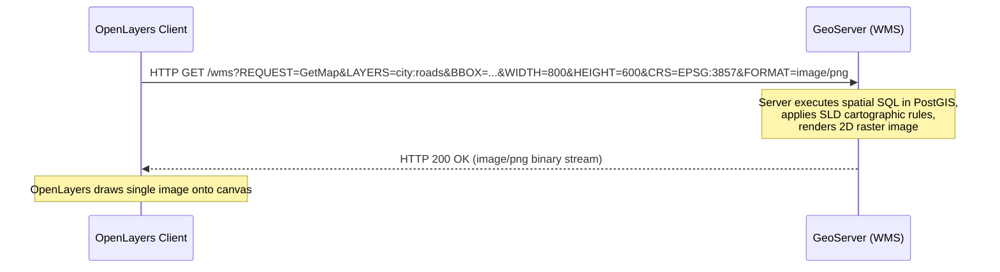

# Module 2 - GIS Data & Web Services

Welcome to Module 2! In this module, we explore how OpenLayers consumes, renders, and manages real-world geospatial data across web architectures. 

In Web GIS, spatial datasets are rarely hardcoded into client applications. Instead, OpenLayers requests data across a distributed pipeline—from local files like GeoJSON, raster sources like Cloud-Optimized GeoTIFFs, OGC web services like WMS and WMTS, to modern binary vector tile streams. Understanding these data formats, encoding schemes, and network protocols is essential for building scalable, high-performance mapping applications.

---

## 1. Introduction to Web GIS Data

### 1.1 How OpenLayers Gets GIS Data
Unlike desktop GIS software (such as QGIS or ArcGIS Pro) that has direct, uninhibited access to local filesystems and multi-gigabyte files, Web GIS applications operate within the strict sandbox of a web browser:
- **Client (Browser):** OpenLayers requests only the precise data slices required for the active viewport extent and zoom level.
- **Server / Service Tier:** Map servers (GeoServer, MapServer) or cloud tile servers process spatial queries, reproject geometries, or render map images on demand.

```text
                  DISTRIBUTED WEB GIS ARCHITECTURE
Browser (OpenLayers)               Map Server / Tile CDN            Database Tier
 ┌────────────────┐               ┌────────────────────┐          ┌─────────────┐
 │ Viewport       │ ──HTTP GET──▶ │ GeoServer / S3     │ ──SQL──▶ │ PostGIS     │
 │ Canvas / WebGL │ ◀──PNG / PBF─ │ Dynamic / Cached   │ ◀─Geom── │ Spatial DB  │
 └────────────────┘               └────────────────────┘          └─────────────┘
```

### 1.2 Client vs. Server Responsibilities

| Responsibility | Server Tier (GeoServer, PostGIS, Tile CDN) | Client Tier (OpenLayers in Browser) |
|---|---|---|
| **Data Storage** | Stores gigabytes to terabytes of spatial data | Holds only features and tiles for active viewport |
| **Heavy Processing** | Spatial SQL joins, topological clipping, raster reprojection | Coordinate transformation, GeoJSON parsing, client styling |
| **Rendering** | Generates pre-rendered raster tiles or WMS images | Draws vector geometries on HTML5 Canvas or WebGL |
| **Interactivity** | Responds to spatial protocol requests (`GetMap`, `GetFeature`) | Instant click/hover detection, popups, layer toggling |
| **Memory Budget** | Scalable enterprise RAM / disk storage | Restricted to browser tab memory (typically < 1.5 GB) |

### 1.3 Data Delivery Formats: Vector, Raster, and Tiled
- **Vector Data:** Raw geometry coordinates (Points, LineStrings, Polygons) and associated attribute dictionaries. Rendered dynamically in the browser, allowing client-side styling, hover effects, and geometry modification.
- **Raster Data:** Continuous grid of pixel values (satellite imagery, aerial orthophotos, elevation models, heatmaps). Each pixel represents a color or a physical measurement.
- **Tiled Data:** Pre-cut, spatially indexed square image or vector segments arranged in a quadtree pyramid (`{z}/{x}/{y}`). Enables fast spatial retrieval and global caching.

---

## 2. Vector Data & GeoJSON

Vector data represents geographical features using discrete coordinate pairs.

### 2.1 The GeoJSON Specification (RFC 7946)
**GeoJSON** is an open standard format based on JSON for encoding geographic data structures. Under RFC 7946:
1. **Coordinate Reference System:** GeoJSON coordinates are strictly defined in geographic coordinates: **WGS 84 (`EPSG:4326`)** in decimal degrees.
2. **Axis Ordering:** Coordinates are strictly ordered as **`[Longitude, Latitude, Elevation]`** (`[X, Y, Z]`).
3. **Polygon Winding Order (Right-Hand Rule):** Exterior boundary rings must follow a **counter-clockwise** direction; interior rings (holes) must follow a **clockwise** direction.
4. **Coordinate Precision:** Six decimal places (`0.000001°`) provides ~0.1 meter accuracy on the ground. Storing 15 decimal places bloats JSON file sizes without providing real-world value.

```json
{
  "type": "FeatureCollection",
  "features": [
    {
      "type": "Feature",
      "geometry": {
        "type": "Polygon",
        "coordinates": [
          [
            [73.85, 18.52],
            [73.86, 18.52],
            [73.86, 18.53],
            [73.85, 18.53],
            [73.85, 18.52]
          ]
        ]
      },
      "properties": {
        "id": 101,
        "name": "Central District",
        "zoning": "Commercial",
        "tax_rate": 1.25
      }
    }
  ]
}
```

### 2.2 Loading Local GeoJSON in OpenLayers
In OpenLayers, vector datasets require a `VectorSource` connected to a `VectorLayer`. OpenLayers automatically reprojects GeoJSON coordinates from `EPSG:4326` to the map view's projection (`EPSG:3857`):

```javascript
import VectorSource from 'ol/source/Vector.js';
import VectorLayer from 'ol/layer/Vector.js';
import GeoJSON from 'ol/format/GeoJSON.js';

const vectorSource = new VectorSource({
  url: './data/parcels.geojson',
  format: new GeoJSON() // Automatically reads WGS84 and transforms to View projection
});

const vectorLayer = new VectorLayer({
  source: vectorSource,
  zIndex: 2
});

map.addLayer(vectorLayer);
```

### 2.3 Styling GeoJSON Features
OpenLayers enables client-side vector styling using `Style`, `Fill`, and `Stroke`:

```javascript
import { Style, Fill, Stroke } from 'ol/style.js';

vectorLayer.setStyle(new Style({
  fill: new Fill({
    color: 'rgba(33, 150, 243, 0.35)' // Semi-transparent blue fill
  }),
  stroke: new Stroke({
    color: '#1565C0',
    width: 2
  })
}));
```

### 2.4 Reading Feature Properties on Click
Because vector coordinates exist directly in browser memory, feature inspection is instantaneous:

```javascript
map.on('click', (event) => {
  map.forEachFeatureAtPixel(event.pixel, (feature, layer) => {
    if (layer === vectorLayer) {
      console.log('Feature Name:', feature.get('name'));
      console.log('Zoning Category:', feature.get('zoning'));
    }
  });
});
```

### 2.5 Limitations of GeoJSON
- **Text-Based Inefficiency:** JSON is an uncompressed ASCII text format. A dataset with 50,000 polygons can easily exceed 40 MB in raw file size.
- **Parsing Overhead:** The browser must parse the entire string via `JSON.parse()`, allocate thousands of JavaScript objects, and convert each coordinate pair into internal geometry instances.
- **Full Dataset Transfer:** The client must download the entire GeoJSON file even if the user only views a tiny corner of the map.
- **Rule of Thumb:** Use raw GeoJSON for datasets under **5,000 features**. For larger datasets, transition to **Vector Tiles (MVT)** or server-side **WMS**.

---

## 3. Raster Data & GeoTIFF

Raster datasets represent continuous geographical surfaces as a regular grid of rectangular cells (pixels).

```text
Continuous Raster Surface (Pixels) vs. Discrete Vector Features (Coordinates)
┌───┬───┬───┬───┐          Polygon (X, Y Vertices)
│240│242│245│250│             (X3, Y3) ────── (X2, Y2)
├───┼───┼───┼───┤                │                │
│238│240│243│248│                │                │
├───┼───┼───┼───┤             (X0, Y0) ────── (X1, Y1)
│235│237│240│244│
└───┴───┴───┴───┘
```

### 3.1 What is a GeoTIFF?
A **GeoTIFF** is a standard TIFF (Tagged Image File Format) image file enriched with spatial metadata tags embedded directly within its header:
- **ModelTiepointTag:** Maps raster pixel coordinates `(pixel, line)` to real-world ground coordinates `(easting, northing)`.
- **ModelPixelScaleTag:** Defines the ground distance represented by a single pixel (spatial resolution, e.g. 0.5 meters/pixel).
- **GeoKeyDirectoryTag:** Encodes the projection, datum, and coordinate system (e.g. `EPSG:32643`).

### 3.2 Cloud-Optimized GeoTIFFs (COG)
A traditional GeoTIFF requires downloading the entire multi-gigabyte file before reading any pixels. A **Cloud-Optimized GeoTIFF (COG)** is structured specifically for streaming:
1. **Internal Tiling:** Pixels are organized into internal $256 \times 256$ or $512 \times 512$ tile blocks rather than full-width horizontal strips.
2. **Internal Overviews (Pyramids):** Downsampled versions of the image are pre-computed and stored inside the file header.
3. **HTTP Range Requests:** OpenLayers requests only the specific byte offsets required for the current view extent directly from object storage (S3/GCS/CDN) using standard HTTP `Range: bytes=start-end` headers.

### 3.3 Loading COGs with WebGL in OpenLayers
OpenLayers features a dedicated hardware-accelerated WebGL tile pipeline (`ol/layer/WebGLTile` + `ol/source/GeoTIFF`):

```javascript
import WebGLTileLayer from 'ol/layer/WebGLTile.js';
import GeoTIFF from 'ol/source/GeoTIFF.js';

const cogLayer = new WebGLTileLayer({
  source: new GeoTIFF({
    sources: [
      {
        url: 'https://sentinel-cogs.s3.amazonaws.com/sentinel-s2-l2a-cogs/sample.tif'
      }
    ]
  })
});

map.addLayer(cogLayer);
```

---

## 4. Reprojection & Coordinate Transformations

Web maps frequently combine datasets produced under different Coordinate Reference Systems (e.g., an aerial orthoimagery raster in UTM Zone 43N displayed over an OpenStreetMap base map in Web Mercator).

### 4.1 How Client-Side Reprojection Works
When a raster or vector source has a different projection than the map `View`, OpenLayers performs **client-side reprojection**:
- **Vector Reprojection:** OpenLayers converts each vertex coordinate mathematically on the fly before drawing paths onto the canvas.
- **Raster Reprojection:** OpenLayers computes an internal bounding grid, creates a triangular mesh, and samples pixel values from the source projection into the target view projection using bilinear interpolation.

### 4.2 Universal Transverse Mercator (UTM)
**UTM** is a global projected coordinate system that divides the Earth into 60 longitudinal zones, each $6^\circ$ wide:
- Uses the Transverse Mercator conformal projection.
- Coordinates are expressed in linear **meters** (Eastings and Northings).
- Distortions are minimal (< 0.1%) within each zone, making UTM the standard for high-accuracy surveying, engineering, and national mapping.

### 4.3 Registering UTM Projections with Proj4js
OpenLayers natively understands `EPSG:4326` and `EPSG:3857`. For regional projections like Indian UTM Zone 43N (`EPSG:32643`), register the projection parameters using `proj4js`:

```javascript
import proj4 from 'proj4';
import { register } from 'ol/proj/proj4.js';
import { get as getProjection } from 'ol/proj.js';

// 1. Define projection parameters from epsg.io
proj4.defs(
  'EPSG:32643',
  '+proj=utm +zone=43 +datum=WGS84 +units=m +no_defs'
);

// 2. Register definitions with OpenLayers
register(proj4);

// 3. Obtain projection handle
const utm43n = getProjection('EPSG:32643');
```

---

## 5. Web Map Service (WMS)

When spatial layers contain millions of complex polygon vertices or massive raster mosaics, sending raw geometries to the browser is computationally impossible. **WMS** solves this by moving rendering entirely to the server.

### 5.1 What is WMS?
**WMS (Web Map Service)** is an OGC international standard where a spatial server (like GeoServer or MapServer) renders map graphics into a flattened raster image (PNG, JPEG) and streams it to the client.



### 5.2 `ImageWMS` vs. `TileWMS`
OpenLayers supports two distinct WMS architectures:

| Architectural Feature | `ImageWMS` (Single Untiled Image) | `TileWMS` (Tiled Grid Images) |
|---|---|---|
| **Request Mechanism** | Single HTTP request sized to viewport | Multiple parallel requests for 256x256 tiles |
| **Label Quality** | **Perfect** (labels never chopped by tile edges) | Labels may be duplicated or clipped at boundaries |
| **Cacheability** | Low (every pan/zoom generates a unique BBOX) | **High** (fixed tile grid cached by CDNs and GeoWebCache) |
| **Pan Experience** | Blank canvas until the new single image loads | Progressive tile loading (adjacent tiles stay visible) |
| **Best Used For** | Thematic overlays, dense text labels, cadastre | Base maps, high-traffic layers, regional mosaics |

### 5.3 Core WMS Request Parameters

| Parameter | Purpose | Example |
|---|---|---|
| `SERVICE` | Protocol identifier | `WMS` |
| `VERSION` | Protocol version | `1.3.0` (or `1.1.1`) |
| `REQUEST` | OGC operation name | `GetMap` |
| `LAYERS` | Qualified layer or layer group identifier | `training:districts` |
| `STYLES` | Named SLD style on server (empty uses default) | `''` |
| `CRS` / `SRS` | Coordinate Reference System (`CRS` in 1.3.0, `SRS` in 1.1.1) | `EPSG:3857` |
| `BBOX` | Bounding box coordinates | `minX,minY,maxX,maxY` |
| `WIDTH` / `HEIGHT` | Requested image dimensions in pixels | `800, 600` |
| `FORMAT` | Returned MIME format | `image/png` |
| `TRANSPARENT` | Enables alpha transparency for background | `true` |

```javascript
import ImageLayer from 'ol/layer/Image.js';
import ImageWMS from 'ol/source/ImageWMS.js';

const wmsLayer = new ImageLayer({
  source: new ImageWMS({
    url: 'https://demo.geoserver.org/geoserver/wms',
    params: {
      'LAYERS': 'ne:ne_10m_admin_0_countries',
      'TRANSPARENT': true,
      'FORMAT': 'image/png'
    },
    serverType: 'geoserver' // Optimizes error parsing and vendor parameters
  }),
  zIndex: 1
});

map.addLayer(wmsLayer);
```

---

## 6. XYZ & Tiled Raster Services

### 6.1 Why Tiled Maps Are Fast
Instead of rendering custom images on demand for arbitrary extents, tile services slice the world into fixed, pre-rendered $256 \times 256$ pixel image squares across standardized zoom levels.

- **Aggressive Caching:** Tiles are immutable static image files. Web browsers and Content Delivery Networks (CDNs) cache them globally with long HTTP `Cache-Control` headers.
- **Progressive Loading:** As a user pans, only newly revealed grid tiles are fetched over the network; existing tiles remain visible on screen.

### 6.2 The Slippy Map `{z}/{x}/{y}` Coordinate Scheme
Tiles are addressed by three integers:
- **`z` (Zoom level):** Pyramid depth ($0$ = whole world in one tile; $18$ = building level).
- **`x` (Column index):** Horizontal index from West to East ($0$ to $2^z - 1$).
- **`y` (Row index):** Vertical index from North to South ($0$ to $2^z - 1$).

```text
SLIPPY MAP QUAD-TREE PYRAMID:
Zoom 0:  1 tile  (256 x 256 px)  ── Whole Earth
Zoom 1:  4 tiles (512 x 512 px)
Zoom 2:  16 tiles (1024 x 1024 px)
...
Zoom z:  4^z tiles
```

#### The Slippy Map Math:
Given a longitude $\lambda$ and latitude $\phi$ in degrees, the tile coordinates at zoom $z$ are:
$$x = \left\lfloor \frac{\lambda + 180}{360} \cdot 2^z \right\rfloor$$
$$y = \left\lfloor \left(1 - \frac{\ln(\tan(\phi \cdot \frac{\pi}{180}) + \sec(\phi \cdot \frac{\pi}{180}))}{\pi}\right) \cdot 2^{z-1} \right\rfloor$$

```javascript
import TileLayer from 'ol/layer/Tile.js';
import XYZ from 'ol/source/XYZ.js';

const osmBaseLayer = new TileLayer({
  source: new XYZ({
    url: 'https://tile.openstreetmap.org/{z}/{x}/{y}.png',
    attributions: '© OpenStreetMap contributors'
  }),
  zIndex: 0
});
```

---

## 7. Web Map Tile Service (WMTS)

### 7.1 XYZ vs. WMTS
- **XYZ:** An informal, de facto convention popularized by Google Maps. Relies entirely on a URL string pattern (`{z}/{x}/{y}.png`). Fast and universally supported, but lacks formal metadata definitions.
- **WMTS (Web Map Tile Service):** The official **OGC standard** (OGC 07-057r7) for serving pre-rendered tile pyramids. Includes a formal XML metadata document (`GetCapabilities`) defining explicit coordinate reference systems, bounding boxes, matrix dimensions, and scale denominators.

### 7.2 Core WMTS Concepts
- **`TileMatrixSet`:** Defines the coordinate reference system and scale levels.
- **Standardized Scale Denominator:** WMTS standardizes screen display pixel size at exactly **$0.28\text{ mm} \times 0.28\text{ mm}$** ($1 / 0.00028 \approx 3,571.43\text{ pixels/meter}$). This allows precise cartographic scale calculation across different client devices.

---

## 8. Vector Tiles (MVT)

**Vector Tiles** represent the modern evolution of tiled mapping, combining the performance benefits of tile pyramids with the dynamic styling flexibility of raw vector data.

```text
Raster Tiles:  [ Fixed Bitmap Pixels ] ──▶ Displayed Directly on Canvas (No Styling / Hover)
Vector Tiles:  [ Binary Geometries & Attributes ] ──▶ Styled Dynamically by OpenLayers in Browser
```

### 8.1 The Mapbox Vector Tile (MVT) Standard
1. **Binary Encoding:** Vector tiles are encoded using **Google Protocol Buffers (Protobuf)** (`.mvt` or `.pbf`). Binary encoding reduces payload sizes by 80% compared to equivalent GeoJSON files.
2. **Local Coordinate Quantization:** Geometries within each tile are transformed from global coordinates into local integer coordinates on a fixed grid (typically $4096 \times 4096$ units). This eliminates floating-point coordinate bloat.
3. **Feature Slicing & Simplification:** Polygons and lines extending across tile boundaries are pre-clipped at tile edges. Low zoom levels feature automatically simplified geometries, preventing browser overdraw.

### 8.2 Rendering Vector Tiles in OpenLayers
OpenLayers uses `ol/layer/VectorTile` and `ol/source/VectorTile` with `ol/format/MVT`:

```javascript
import VectorTileLayer from 'ol/layer/VectorTile.js';
import VectorTileSource from 'ol/source/VectorTile.js';
import MVT from 'ol/format/MVT.js';
import { Style, Fill, Stroke } from 'ol/style.js';

const vectorTileLayer = new VectorTileLayer({
  source: new VectorTileSource({
    format: new MVT(),
    url: 'https://basemaps.arcgis.com/arcgis/rest/services/World_Basemap_v2/VectorTileServer/tile/{z}/{y}/{x}.pbf'
  }),
  style: new Style({
    fill: new Fill({ color: '#f0f0f0' }),
    stroke: new Stroke({ color: '#cccccc', width: 1 })
  })
});
```

---

## 9. Inspecting & Debugging Web GIS Requests

Mastering browser Developer Tools (**F12** $\rightarrow$ **Network Tab**) is critical for diagnosing Web GIS issues.

```text
Network Inspection Workflow:
1. Open DevTools (F12) ──▶ Select Network Tab ──▶ Filter by "Fetch/XHR" or "Img"
2. Pan the map ──▶ Observe outgoing requests
3. Click request ──▶ Inspect Request URL, Query Parameters, Headers & Response Payload
```

### 9.1 Common HTTP Status Codes in Web GIS

| Status Code | Meaning | Common Cause in OpenLayers |
|---|---|---|
| **`200 OK`** | Request Successful | Image or vector data returned properly. |
| **`400 Bad Request`** | Invalid Parameters | Misspelled parameter, unsupported CRS, or missing `LAYERS` argument. GeoServer returns an XML `ServiceExceptionReport`. |
| **`401 / 403 Forbidden`** | Unauthorized | Restricted GeoServer workspace or missing authentication token. |
| **`404 Not Found`** | Missing Endpoint | Misspelled base URL path (`/geoserver/wms`) or incorrect layer name. |
| **`500 Server Error`** | Server Exception | Database connection failure, out-of-memory error, or broken SLD style file on the server. |
| **`CORS Error`** | Cross-Origin Blocked | The remote server lacks `Access-Control-Allow-Origin: *` HTTP response headers. |

---

## 10. Choosing the Right Data Source

Use this decision matrix when architecting Web GIS systems:

| Requirement / Scenario | Recommended Solution | Architectural Rationale |
|---|---|---|
| Small vector dataset (< 5,000 features) | **GeoJSON** | Simple, text-based, instant client-side interaction |
| Large vector dataset (> 20,000 features) | **Vector Tiles (MVT)** | High performance, crisp vector rendering, low bandwidth |
| Enterprise cartography / millions of polygons | **WMS (`ImageWMS` or `TileWMS`)** | Server handles heavy polygon clipping and label collision |
| Public world base map | **XYZ (OSM / Carto)** | Globally cached on CDNs, fast, zero server infrastructure |
| Direct raster analysis (elevation, NDVI) | **GeoTIFF + WebGL** | GPU shader calculations in browser, no server required |
| Dynamic client-side thematic styling | **Vector / Vector Tiles** | Full color, stroke, and visibility control in JavaScript |
| Formal enterprise / government compliance | **WMTS** | Standardized OGC metadata and explicit scale matrices |

---

### Reference resources

- **OGC Standards Overview:** [https://www.ogc.org/standards/](https://www.ogc.org/standards/)
- **GeoJSON Specification (RFC 7946):** [https://geojson.org/](https://geojson.org/)
- **Mapbox Vector Tile Specification:** [https://github.com/mapbox/vector-tile-spec](https://github.com/mapbox/vector-tile-spec)
- **OpenLayers Sources API:** [https://openlayers.org/en/latest/apidoc/module-ol_source.html](https://openlayers.org/en/latest/apidoc/module-ol_source.html)
- **EPSG Coordinate Reference System Lookup:** [https://epsg.io/](https://epsg.io/)

### Practical activity

**Your Task:**

1. **Create Local GeoJSON:** In your project directory, create `my_data.geojson` containing the polygon FeatureCollection from Section 2.1.
2. **Setup Base Map:** Create a minimal OpenLayers project with an OpenStreetMap `TileLayer` (`XYZ` source).
3. **Add Local Vector Layer:** Add a `VectorLayer` consuming `./my_data.geojson` using `VectorSource` and `GeoJSON` format.
4. **Style the Vector Features:** Apply custom `Fill` and `Stroke` styles to your GeoJSON layer.
5. **Add a WMS Layer:** Add an `ImageLayer` using `ImageWMS` connected to `https://demo.geoserver.org/geoserver/wms` with parameter `LAYERS: 'ne:ne_10m_admin_0_countries'`.
6. **Configure WMS Transparency:** Set `TRANSPARENT: true` so the underlying OSM base map remains visible.
7. **Inspect the Network:** Open your browser's Developer Tools (`F12`) and select the **Network** tab.
8. **Analyze Requests:** Pan and zoom the map, then filter and observe:
   - The initial **GeoJSON** request (loaded once via Fetch/XHR).
   - The **WMS** image request (re-requested on pan/zoom with an updated bounding box).
   - The **XYZ** tile requests (loading individual 256x256 image squares).
9. **Optional Bonus:** Add a local GeoTIFF file using `GeoTIFF` source and `WebGLTileLayer`.

---

#### Example Implementation (`main.js`):

```javascript
import Map from 'ol/Map.js';
import View from 'ol/View.js';
import TileLayer from 'ol/layer/Tile.js';
import ImageLayer from 'ol/layer/Image.js';
import VectorLayer from 'ol/layer/Vector.js';
import OSM from 'ol/source/OSM.js';
import ImageWMS from 'ol/source/ImageWMS.js';
import VectorSource from 'ol/source/Vector.js';
import GeoJSON from 'ol/format/GeoJSON.js';
import { Style, Fill, Stroke } from 'ol/style.js';
import { fromLonLat } from 'ol/proj.js';
import 'ol/ol.css';

// 1. Base Layer: OpenStreetMap (XYZ Raster Tiles)
const osmLayer = new TileLayer({
  source: new OSM(),
  zIndex: 0
});

// 2. WMS Layer: Countries from GeoServer
const wmsLayer = new ImageLayer({
  source: new ImageWMS({
    url: 'https://demo.geoserver.org/geoserver/wms',
    params: {
      'LAYERS': 'ne:ne_10m_admin_0_countries',
      'TRANSPARENT': true,
      'FORMAT': 'image/png'
    },
    serverType: 'geoserver'
  }),
  opacity: 0.6,
  zIndex: 1
});

// 3. Vector Layer: Local GeoJSON
const vectorLayer = new VectorLayer({
  source: new VectorSource({
    features: new GeoJSON().readFeatures({
      type: 'FeatureCollection',
      features: [
        {
          type: 'Feature',
          properties: { name: 'Sample Region', category: 'Zone A' },
          geometry: {
            type: 'Polygon',
            coordinates: [
              [
                fromLonLat([73.85, 18.52]),
                fromLonLat([73.86, 18.52]),
                fromLonLat([73.86, 18.53]),
                fromLonLat([73.85, 18.53]),
                fromLonLat([73.85, 18.52])
              ]
            ]
          }
        }
      ]
    })
  }),
  style: new Style({
    fill: new Fill({ color: 'rgba(255, 152, 0, 0.4)' }),
    stroke: new Stroke({ color: '#E65100', width: 2 })
  }),
  zIndex: 2
});

// 4. Initialize Map
const map = new Map({
  target: 'map',
  layers: [osmLayer, wmsLayer, vectorLayer],
  view: new View({
    center: fromLonLat([73.8567, 18.5204]),
    zoom: 12
  })
});
```