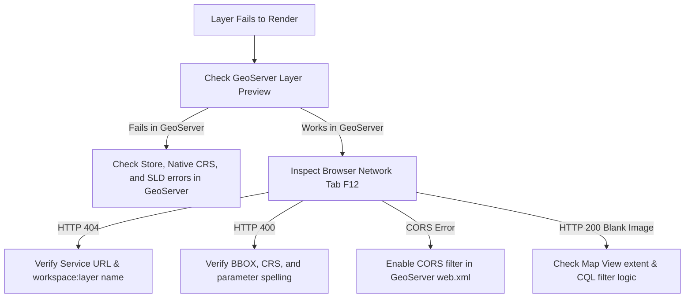

# Module 3 - GeoServer & OpenLayers

Welcome to Module 3! In this module, we transition from simply consuming static files to understanding **how GeoServer publishes, styles, and controls geospatial data**, and how OpenLayers interacts with it across enterprise Web GIS architectures.

---

## 1. Introduction to GeoServer

### 1.1 What is GeoServer?
**GeoServer** is an open-source software server written in Java that allows users to share, process, and edit geospatial data. Developed to adhere strictly to Open Geospatial Consortium (OGC) standards, GeoServer is the industry standard for publishing maps and data from spatial databases to client mapping libraries like OpenLayers.

Under the hood, GeoServer is built upon the **GeoTools** spatial library and runs inside a Java Servlet container (such as Apache Tomcat or Eclipse Jetty). It acts as an abstraction layer between enterprise storage and web clients.

### 1.2 GeoServer in the Web GIS Architecture
GeoServer sits in the middle tier between your raw spatial storage and client web applications:

```text
               ENTERPRISE 3-TIER ARCHITECTURE
Storage Tier:       PostGIS / Shapefiles / GeoPackage / GeoTIFF
                                  ↓ (JDBC / File I/O)
Middleware Tier:              GeoServer
                    (GeoTools Engine, SLD Styler, WMS/WFS/WMTS)
                                  ↓ (HTTP / OGC Web Services)
Client Tier:                  OpenLayers
                    (Canvas / WebGL Engine, Layer Management)
                                  ↓
Presentation Tier:         Web Browser Viewport
```

### 1.3 The OpenLayers + GeoServer Workflow

- **Storage Tier:** Spatial datasets reside in an enterprise relational database (PostGIS) or flat files (Shapefile, GeoPackage, GeoTIFF).
- **Publishing Tier:** GeoServer connects to the data store, verifies coordinate reference systems, computes spatial bounding boxes, applies cartographic styling rules (SLD), and exposes standard OGC endpoints.
- **Client Tier:** OpenLayers requests rendered map images (WMS) or raw vector features (WFS) dynamically as the user navigates.

---

## 2. GeoServer Data Hierarchy

To manage datasets across large organizations, GeoServer organizes data into a strict four-level administrative hierarchy:

```text
Workspace (Logical container & XML namespace)
   └── Store (Physical connection to database or directory)
        └── Layer / FeatureType (Individual spatial table or file)
             └── Style (SLD cartographic symbology)
```

### 2.1 The Components Explained:

- **Workspace:** A logical container and XML namespace grouping related stores and layers together (e.g., `training`, `city_planning`). It prevents layer naming collisions across different departments or projects.
- **Store:** The physical connection configuration to a data source (e.g., PostGIS database connection parameters, path to a directory of Shapefiles, or a GeoTIFF file).
- **Resource / Layer:** An individual spatial table or file published from a store with a verified Coordinate Reference System, bounding box, and assigned style.
- **Layer Group:** A combined service endpoint that packages multiple layers together in a fixed rendering order, allowing OpenLayers to request multiple thematic layers in a single HTTP request.

### 2.2 Understanding Layer Qualified Names
In GeoServer, layers are referenced using the format:
```text
workspace:layer_name
```
Examples:
```text
training:roads
training:buildings
training:parcels
```

---

## 3. Connecting Data Sources to GeoServer

GeoServer supports diverse vector and raster data formats through specialized data store adapters:

```text
Data Source → Store → Layer → OGC Service
```

### 3.1 Vector Data Sources

- **PostGIS:** The enterprise standard. Connects to PostgreSQL spatial tables with live spatial querying, spatial indexing (`GiST`), multi-user editing, and ACID transaction safety.
- **Directory of Shapefiles:** Connects to a folder containing `.shp`, `.shx`, `.dbf`, and `.prj` files. Great for rapid local testing.
- **GeoPackage (GPKG):** A modern, single-file SQLite database containing multiple vector and raster layers according to OGC standards.
- **GeoJSON:** Flat JSON files containing vector feature collections.

### 3.2 Raster Data Sources

- **GeoTIFF:** Single georeferenced raster file (satellite imagery, aerial orthophotos, elevation models).
- **ImageMosaic:** Connects to a catalog of multiple adjacent raster tiles, merging them into a seamless continuous layer with spatial indexing and time-series dimensions.

---

## 4. Publishing a Layer in GeoServer

Publishing spatial data in GeoServer follows an 8-step workflow:

```text
1. Create Workspace → 2. Add Store → 3. Select Source → 4. Publish Layer
        ↓
5. Verify CRS → 6. Calculate Bounding Boxes → 7. Configure Style → 8. Layer Preview
```

### 4.1 Step-by-Step Publishing Workflow

- **Create Workspace:** Define a name (e.g., `training`) and a unique Namespace URI (e.g., `http://localhost/training`).
- **Add Data Store:** Select your store type (PostGIS, Directory of Shapefiles, or GeoTIFF) and provide connection parameters.
- **Select Data Source:** GeoServer reads the store and lists available tables or files. Click **Publish** next to the desired dataset.
- **Configure Coordinate Reference Systems (CRS):**
  - **Native CRS:** The coordinate system detected directly within the dataset header (e.g., `EPSG:4326` or `EPSG:32643`).
  - **Declared CRS:** What GeoServer publishes to clients.
  - **SRS Handling Policies:**
    - *Force Declared:* Overrides the native CRS if it is missing or misidentified.
    - *Reproject native to declared:* Uses GeoTools to reproject coordinates on ingest.
- **Compute Bounding Boxes:**
  - Click **Compute from data** to calculate the **Native Bounding Box**.
  - Click **Compute from native bounds** to calculate the **Lat/Lon Bounding Box** in WGS 84 degrees.
  - *If bounding boxes are missing or set to zero, OpenLayers will not be able to display the layer.*
- **Assign Style:** In the **Publishing** tab, assign a Default Style (SLD).
- **Save and Preview:** Click **Save**. Navigate to **Layer Preview** in the GeoServer sidebar and select **OpenLayers** to confirm rendering.

---

## 5. GetCapabilities & Service Metadata

Before writing client-side code, inspect GeoServer's **`GetCapabilities`** XML document to determine valid layer names, supported projections, bounding boxes, and available image formats.

```text
Client ──HTTP GET: REQUEST=GetCapabilities──▶ GeoServer ──Returns XML Document──▶ Client
```

### 5.1 Querying GetCapabilities
Append `REQUEST=GetCapabilities` to your service URL:
- **WMS:** `http://localhost:8080/geoserver/wms?service=WMS&version=1.3.0&request=GetCapabilities`
- **WFS:** `http://localhost:8080/geoserver/wfs?service=WFS&version=2.0.0&request=GetCapabilities`

### 5.2 Key Information to Inspect:

- **Layer Names:** Look for `<Layer><Name>training:roads</Name></Layer>`. The string inside `<Name>` is the exact identifier required by OpenLayers.
- **Supported CRS:** Verify that your target projection (e.g., `EPSG:3857`, `EPSG:4326`) is listed under `<CRS>`.
- **Supported Formats:** Check `<Format>` tags for available image types (`image/png`, `image/jpeg`) or vector formats (`application/json`).
- **Bounding Boxes:** `<EX_GeographicBoundingBox>` provides latitude/longitude limits used to set initial map view extents.

---

## 6. WMS with GeoServer

**WMS (Web Map Service)** renders map images on the server and streams them to OpenLayers as raster pictures.

### 6.1 `ImageWMS` vs. `TileWMS`

- **`ImageWMS` (Single Image):** Requests a single image covering the whole map canvas for the current extent.
  - *Best for:* Thematic maps and layers with dense text labels (prevents labels being chopped at tile boundaries).
- **`TileWMS` (Tiled Images):** Requests WMS imagery in a grid of 256x256 pixel tiles.
  - *Best for:* Base maps, high-traffic layers, and caching via GeoWebCache.

### 6.2 Key WMS Request Parameters

| Parameter | Purpose | Example |
|---|---|---|
| `LAYERS` | Qualified name of the layer or layer group | `'training:roads'` |
| `STYLES` | Named SLD style on GeoServer (empty uses default) | `''` |
| `FORMAT` | Output image MIME format | `'image/png'` |
| `TRANSPARENT`| Enables canvas transparency so lower layers show through | `true` |
| `VERSION` | OGC WMS protocol version | `'1.3.0'` |

### 6.3 OpenLayers WMS Implementation

```javascript
import ImageLayer from 'ol/layer/Image.js';
import ImageWMS from 'ol/source/ImageWMS.js';

const wmsLayer = new ImageLayer({
  source: new ImageWMS({
    url: 'http://localhost:8080/geoserver/wms',
    params: {
      'LAYERS': 'training:roads',
      'TRANSPARENT': true,
      'FORMAT': 'image/png'
    },
    serverType: 'geoserver' // Enables optimized error handling and vendor parameters
  })
});

map.addLayer(wmsLayer);
```

---

## 7. GeoServer Styling – SLD

**SLD (Styled Layer Descriptor)** is an OGC XML-based styling language that instructs GeoServer how to draw vector features into map images.

### 7.1 Why Server-Side Styling?
- **Consistency:** The exact same cartographic rules apply whether the layer is viewed in OpenLayers, QGIS, or an embedded dashboard.
- **Zero Client Overhead:** The server handles all label placement, complex line dashes, and polygon hatching without consuming browser CPU.

### 7.2 SLD Structure & Symbolizers

An SLD document consists of:

`NamedLayer` $\rightarrow$ `UserStyle` $\rightarrow$ `FeatureTypeStyle` $\rightarrow$ `Rule` $\rightarrow$ `Symbolizer`

- `PointSymbolizer`: Circles, squares, SVG icons.
- `LineSymbolizer`: Color, width, dash array.
- `PolygonSymbolizer`: Fill color, opacity, stroke outline.
- `TextSymbolizer`: Label field, font family, halo, placement.

### 7.3 Classification Example
Rules can filter features using attributes to create thematic maps:

```text
Roads
 ├── Rule 1: type = 'highway' → Red line (width: 4px)
 ├── Rule 2: type = 'primary' → Orange line (width: 3px)
 └── Rule 3: type = 'local'   → Gray line (width: 1px)
```

```xml
<Rule>
  <Name>Highways</Name>
  <ogc:Filter>
    <ogc:PropertyIsEqualTo>
      <ogc:PropertyName>type</ogc:PropertyName>
      <ogc:Literal>highway</ogc:Literal>
    </ogc:PropertyIsEqualTo>
  </ogc:Filter>
  <LineSymbolizer>
    <Stroke>
      <CssParameter name="stroke">#D32F2F</CssParameter>
      <CssParameter name="stroke-width">4</CssParameter>
    </Stroke>
  </LineSymbolizer>
</Rule>
```

---

## 8. WMS Filtering with GeoServer (CQL)

GeoServer supports **CQL (Common Query Language)** and **ECQL (Extended CQL)**, allowing OpenLayers to filter server-side data dynamically on the fly without modifying SLD files.

```text
OpenLayers → CQL_FILTER parameter → GeoServer → Filtered Map Image
```

### 8.1 Common CQL Filter Patterns

| Filter Type | CQL Expression | Description |
|---|---|---|
| **String Comparison** | `type = 'highway'` | Exact string match |
| **Numeric Comparison** | `lanes >= 4` | Greater than or equal |
| **Range Filter** | `speed_limit BETWEEN 40 AND 80` | Value within range |
| **Logical Combination**| `type = 'highway' AND lanes >= 4` | Multiple conditions |
| **String Pattern** | `name LIKE 'Main%'` | Wildcard matching |
| **Spatial Bounding** | `BBOX(geom, 73.8, 18.5, 73.9, 18.6)`| Features within bounding box |

### 8.2 Applying CQL Filters Dynamically in OpenLayers
Use `source.updateParams()` to apply or clear filters at runtime:

```javascript
// 1. Apply a filter: show only highways
wmsLayer.getSource().updateParams({
  'CQL_FILTER': "type = 'highway'"
});

// 2. Clear the filter: show all features
wmsLayer.getSource().updateParams({
  'CQL_FILTER': null
});
```

---

## 9. WFS – Working with Real Vector Features

While WMS returns a flattened raster image, **WFS (Web Feature Service)** returns the actual vector geometries and attributes (typically as GeoJSON).

```text
GeoServer WFS → GeoJSON → ol/source/Vector → ol/layer/Vector → Browser Canvas
```

### 9.1 WFS Request Structure
A standard WFS `GetFeature` request URL:
```text
http://localhost:8080/geoserver/wfs?
  service=WFS&
  version=2.0.0&
  request=GetFeature&
  typeNames=training:buildings&
  outputFormat=application/json
```

### 9.2 Loading GeoServer WFS in OpenLayers

```javascript
import VectorSource from 'ol/source/Vector.js';
import VectorLayer from 'ol/layer/Vector.js';
import GeoJSON from 'ol/format/GeoJSON.js';
import { Style, Fill, Stroke } from 'ol/style.js';

const wfsLayer = new VectorLayer({
  source: new VectorSource({
    format: new GeoJSON(),
    url: 'http://localhost:8080/geoserver/wfs?service=WFS&version=2.0.0&request=GetFeature&typeNames=training:buildings&outputFormat=application/json'
  }),
  style: new Style({
    fill: new Fill({ color: 'rgba(76, 175, 80, 0.4)' }),
    stroke: new Stroke({ color: '#2E7D32', width: 2 })
  })
});

map.addLayer(wfsLayer);
```

---

## 10. WFS Filtering & Feature Requests

Downloading an entire layer containing 100,000 features over WFS will freeze the browser. GeoServer allows optimizing WFS requests using server-side constraints.

### 10.1 Restricting Features with `CQL_FILTER` and Limits
Append `cql_filter` and `count` (or `maxFeatures` in WFS 1.1) to your request URL:

```text
http://localhost:8080/geoserver/wfs?
  service=WFS&
  version=2.0.0&
  request=GetFeature&
  typeNames=training:buildings&
  outputFormat=application/json&
  cql_filter=status='commercial'&
  count=500
```

### 10.2 Bounding Box Strategy (`bbox`)
Instead of fetching all features upfront, configure OpenLayers to request only features within the user's current viewport extent using the `bbox` loading strategy:

```javascript
import VectorSource from 'ol/source/Vector.js';
import GeoJSON from 'ol/format/GeoJSON.js';
import { bbox as bboxStrategy } from 'ol/loadingstrategy.js';

const dynamicWfsSource = new VectorSource({
  format: new GeoJSON(),
  strategy: bboxStrategy, // Triggers loader whenever the map extent changes
  loader: function (extent, resolution, projection) {
    const projCode = projection.getCode();
    const url = `http://localhost:8080/geoserver/wfs?service=WFS&version=2.0.0&request=GetFeature&typeNames=training:buildings&outputFormat=application/json&srsname=${projCode}&bbox=${extent.join(',')},${projCode}`;

    fetch(url)
      .then((res) => res.json())
      .then((data) => {
        dynamicWfsSource.addFeatures(
          new GeoJSON().readFeatures(data)
        );
      });
  }
});
```

---

## 11. WMS vs. WFS — When to Use What?

Use this decision table when choosing between WMS and WFS:

| Requirement / Capability | WMS (Web Map Service) | WFS (Web Feature Service) |
|---|:---:|:---:|
| **Output Type** | Image picture (PNG, JPEG) | Raw vector geometry (GeoJSON, GML) |
| **Browser Workload** | Very Low | Higher (processes coordinates & DOM paths) |
| **Large Datasets (> 50,000 features)** | **Best Choice** | Unsuitable (high network & memory usage) |
| **Interactive Feature Popups** | Via `GetFeatureInfo` server call | Instant client-side inspection |
| **Client-Side Hover / Dynamic Styling**| ❌ No | ✅ Yes |
| **Feature Geometry Editing** | ❌ No | ✅ Yes (via WFS-T) |
| **Network Payload Size** | Constant (size of one screen image) | Proportional to feature count |

> **Architecture Question:** *Do I need to display visual map imagery (use WMS), or do I need to manipulate, style, or edit raw coordinates in the browser (use WFS)?*

---

## 12. OpenLayers Feature Interaction with GeoServer

### 12.1 WMS Feature Info (`GetFeatureInfo`)
Because WMS layers are flat raster images, OpenLayers cannot directly read vector properties from pixels. Instead, OpenLayers generates a `GetFeatureInfo` request asking GeoServer: *"What feature exists at this pixel coordinate?"*

```text
User clicks map → GetFeatureInfo request → GeoServer → Returns JSON attributes → Display Popup
```

```javascript
map.on('singleclick', (event) => {
  const viewResolution = map.getView().getResolution();
  const url = wmsSource.getFeatureInfoUrl(
    event.coordinate,
    viewResolution,
    'EPSG:3857',
    { 'INFO_FORMAT': 'application/json' }
  );

  if (url) {
    fetch(url)
      .then((response) => response.json())
      .then((data) => {
        if (data.features.length > 0) {
          const feature = data.features[0];
          console.log('Feature Attributes:', feature.properties);
        }
      });
  }
});
```

### 12.2 WFS Client-Side Interaction
With WFS, features exist directly in the browser's memory, allowing instant attribute inspection:

```javascript
map.on('click', (event) => {
  map.forEachFeatureAtPixel(event.pixel, (feature, layer) => {
    if (layer === wfsLayer) {
      console.log('Building Name:', feature.get('name'));
    }
  });
});
```

---

## 13. Layer Groups & Multiple GeoServer Layers

### 13.1 GeoServer Layer Groups
A **Layer Group** is a container that packages multiple layers into a single named WMS service. Instead of sending five separate HTTP requests for roads, rivers, buildings, and parcels, OpenLayers requests one composite image:

```text
LAYERS: 'training:city_basemap' // Renders roads + buildings + parcels combined
```

### 13.2 Client-Side OpenLayers Layer Groups
You can also organize multiple distinct layers on the client using `ol/layer/Group`:

```javascript
import LayerGroup from 'ol/layer/Group.js';

const operationalLayers = new LayerGroup({
  layers: [roadsLayer, buildingsLayer, parcelsLayer]
});

map.addLayer(operationalLayers);

// Toggle entire group visibility at once
// operationalLayers.setVisible(false);
```

---

## 14. Debugging GeoServer + OpenLayers

When a layer fails to render, use the **GeoServer Layer Preview + Browser Network Tab** diagnostic workflow:



### Common HTTP Status Codes & Solutions:

- **`404 Not Found`:** The GeoServer URL path or `LAYERS: 'workspace:layer'` is misspelled.
- **`400 Bad Request`:** Invalid parameters. GeoServer returns an XML `ServiceExceptionReport` explaining the exact syntax error.
- **`401 / 403 Forbidden`:** Workspace security rules are active. Check **Data Security** in GeoServer admin settings.
- **`CORS Error`:** The browser blocked the response. Ensure GeoServer's `web.xml` has the CORS filter un-commented.
- **Blank Image with Status 200:** Check if your map View is centered outside the layer's bounding box, or if a `CQL_FILTER` filtered out all features.

---

### Reference resources

- **GeoServer User Manual:** [https://docs.geoserver.org/](https://docs.geoserver.org/)
- **OGC WMS Standard:** [https://www.ogc.org/standards/wms](https://www.ogc.org/standards/wms)
- **OGC WFS Standard:** [https://www.ogc.org/standards/wfs](https://www.ogc.org/standards/wfs)
- **OpenLayers `ImageWMS` API:** [https://openlayers.org/en/latest/apidoc/module-ol_source_ImageWMS-ImageWMS.html](https://openlayers.org/en/latest/apidoc/module-ol_source_ImageWMS-ImageWMS.html)

### Practical activity

**Your Task:**

#### Part 1 — GeoServer Configuration
1. **Create Workspace:** In your GeoServer admin console, create a new workspace named `training`.
2. **Connect Data Store:** Add a new Vector Data Store (PostGIS table or Directory of Shapefiles) pointing to your sample `roads` dataset.
3. **Publish Layer:** Publish the `roads` layer, verify that the Native CRS is valid, compute the Bounding Boxes, and assign a default line style.
4. **Verify Preview:** Open **Layer Preview** in the GeoServer sidebar and confirm that `training:roads` renders properly.

#### Part 2 — OpenLayers WMS Integration
5. **Setup Map Project:** Create an OpenLayers project with an OpenStreetMap base layer.
6. **Add GeoServer WMS Layer:** Instantiate an `ImageLayer` using `ImageWMS` pointing to your local GeoServer endpoint (`http://localhost:8080/geoserver/wms`) with `LAYERS: 'training:roads'`.
7. **Configure Transparency:** Set `TRANSPARENT: true` so the underlying OSM street map remains visible.

#### Part 3 — Apply Dynamic CQL Filter
8. **Filter WMS Layer:** Add a `CQL_FILTER` parameter to display only highway roads:
   ```javascript
   wmsLayer.getSource().updateParams({
     'CQL_FILTER': "type = 'highway'"
   });
   ```
9. **Analyze Network:** Open your browser's Developer Tools (`F12`), navigate to the **Network** tab, pan the map, and observe the `GetMap` request URL containing your updated `CQL_FILTER` parameter.

#### Optional Bonus Challenge
Add the same `roads` layer as a GeoJSON **WFS** layer (`VectorLayer` + `VectorSource`), apply a custom client-side stroke style, and add a click handler using `forEachFeatureAtPixel` to display road names in an alert or popup.

---

#### Example Implementation (`main.js`):

```javascript
import Map from 'ol/Map.js';
import View from 'ol/View.js';
import TileLayer from 'ol/layer/Tile.js';
import ImageLayer from 'ol/layer/Image.js';
import OSM from 'ol/source/OSM.js';
import ImageWMS from 'ol/source/ImageWMS.js';
import { fromLonLat } from 'ol/proj.js';
import 'ol/ol.css';

// 1. Base Layer: OpenStreetMap
const osmLayer = new TileLayer({
  source: new OSM(),
  zIndex: 0
});

// 2. GeoServer WMS Layer: Published roads dataset
const wmsSource = new ImageWMS({
  url: 'http://localhost:8080/geoserver/wms',
  params: {
    'LAYERS': 'training:roads',
    'TRANSPARENT': true,
    'FORMAT': 'image/png'
  },
  serverType: 'geoserver'
});

const roadsLayer = new ImageLayer({
  source: wmsSource,
  opacity: 0.8,
  zIndex: 1
});

// 3. Initialize Map
const map = new Map({
  target: 'map',
  layers: [osmLayer, roadsLayer],
  view: new View({
    center: fromLonLat([73.85, 18.52]), // Adjust to your dataset coordinates
    zoom: 12
  })
});

// 4. Demonstration: Dynamic CQL Filtering
const filterHighwaysButton = document.getElementById('filter-btn');
if (filterHighwaysButton) {
  filterHighwaysButton.addEventListener('click', () => {
    wmsSource.updateParams({
      'CQL_FILTER': "type = 'highway'"
    });
  });
}

// 5. WMS GetFeatureInfo on Map Click
map.on('singleclick', (event) => {
  const viewResolution = map.getView().getResolution();
  const url = wmsSource.getFeatureInfoUrl(
    event.coordinate,
    viewResolution,
    'EPSG:3857',
    { 'INFO_FORMAT': 'application/json' }
  );

  if (url) {
    fetch(url)
      .then((res) => res.json())
      .then((data) => {
        if (data.features && data.features.length > 0) {
          const props = data.features[0].properties;
          alert(`Road: ${props.name || 'Unnamed'} (Type: ${props.type || 'N/A'})`);
        }
      })
      .catch((err) => console.error('GetFeatureInfo error:', err));
  }
});
```