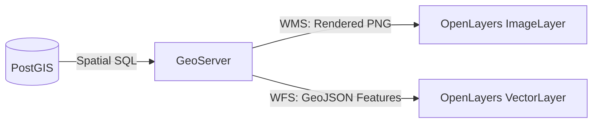

# Module 4 - PostGIS & OpenLayers

Welcome to Module 4! In this module, we examine the data engine behind enterprise Web GIS: **PostGIS**. You will learn how spatial data is modeled in relational databases, how spatial SQL operates under OGC standards, how spatial indexing accelerates spatial queries, how GeoServer exposes database queries, and how OpenLayers consumes the resulting services.

---

## 1. PostGIS & Web GIS Architecture

### 1.1 PostgreSQL vs. PostGIS

- **PostgreSQL:** An enterprise-grade, open-source Object-Relational Database Management System (ORDBMS) known for SQL standard compliance, ACID transactions, complex concurrency, and extensibility.
- **PostGIS:** The spatial extender that transforms PostgreSQL into a full-featured spatial database. PostGIS follows the **OGC Simple Features for SQL (SFS)** specification, adding:
  - Native spatial data types (`geometry`, `geography`, `raster`).
  - Over 1,000 spatial functions for spatial measurement, topological relationships, computational geometry, and format conversions.
  - R-Tree spatial indexing via the **GiST (Generalized Search Tree)** framework.
  - Core spatial metadata views (`geometry_columns`, `geography_columns`, and `spatial_ref_sys`).

### 1.2 The Enterprise Web GIS Data Pipeline
In production architectures, data moves through four distinct operational tiers:

```text
PostGIS Database (Storage & Spatial SQL)
              ↓ (JDBC Connection Pool)
          GeoServer (Publishing & OGC Services)
              ↓ (HTTP Web Services)
      WMS / WFS Endpoints (Map Images & GeoJSON)
              ↓
         OpenLayers (Client Rendering & Interaction)
              ↓
        Browser Canvas (User Viewport)
```

- **Storage & Processing Tier (PostGIS):** Stores raw coordinate vectors, enforces topological constraints, runs complex spatial joins, and filters millions of rows with spatial indexes.
- **Middleware & Service Tier (GeoServer):** Connects to PostGIS via connection pooling, translates spatial tables into standard OGC protocols (WMS, WFS, WMTS), and applies server-side symbology (SLD).
- **Client Tier (OpenLayers):** Requests rendered map images (WMS) or vector geometries (WFS), managing zoom, pan, layer toggles, and user interactions.

### 1.3 Client-Side vs. Server-Side Spatial Processing

| Processing Location | Strengths | Best Used For |
|---|---|---|
| **Server-Side (PostGIS)** | - Handles millions of records effortlessly<br>- Leverages spatial indexes (GiST)<br>- Performs complex spatial joins and heavy geoprocessing | - Spatial containment (`ST_Within`)<br>- Proximity analysis (`ST_DWithin`)<br>- Large-scale buffering and aggregation |
| **Client-Side (OpenLayers)** | - Instant user feedback (no network latency)<br>- Dynamic hover states, tooltips, and popups<br>- Interactive drawing and vector snapping | - Highlighting clicked features<br>- Measuring distances on screen<br>- Client-side styling and layer visibility |

> **Key Architectural Rule:** Always filter, clip, and aggregate as close to the database as possible. Do not send 500,000 features over the network to OpenLayers when the user only needs to see 50.

---

## 2. PostGIS Spatial Data Types

PostGIS adds two primary spatial data types to PostgreSQL: **`geometry`** and **`geography`**.

```text
PostGIS Spatial Data Types
 ├── geometry   → Planar / Cartesian (flat coordinate systems, project-specific, Euclidean math)
 └── geography  → Geodetic / Spherical (curved Earth, WGS 84 EPSG:4326, real-world meters)
```

### 2.1 `geometry` vs. `geography`

| Feature | `geometry` | `geography` |
|---|---|---|
| **Coordinate Space** | Flat Cartesian plane (Euclidean) | Curved sphere / ellipsoid (Great Circle) |
| **Supported Projections** | Any CRS (EPSG:4326, EPSG:3857, UTM, local grids) | Strictly WGS 84 (`EPSG:4326`) |
| **Measurement Units** | Matches CRS units (meters for 3857/UTM; degrees for 4326) | Always in **meters** regardless of coordinates |
| **Performance** | Extremely fast; full spatial function support | Slightly slower computation; subset of functions |
| **Typical Use** | Regional/city mapping, engineering, standard Web GIS | Global flight routes, maritime tracks, global proximity |

### 2.2 Core OGC Geometry Types

PostGIS represents spatial features using Open Geospatial Consortium (OGC) Well-Known Text (WKT) and Extended WKT (EWKT) definitions:

- **Point:** A single coordinate location.
  ```text
  POINT(73.8567 18.5204)
  ```
- **LineString:** A continuous series of connected line segments.
  ```text
  LINESTRING(73.85 18.52, 73.86 18.53, 73.87 18.55)
  ```
- **Polygon:** A closed ring forming an outer boundary, with optional interior rings (holes).
  ```text
  POLYGON((73.85 18.52, 73.86 18.52, 73.86 18.53, 73.85 18.53, 73.85 18.52))
  ```
- **MultiPoint:** A collection of separate points treated as one database entity.
- **MultiLineString:** A collection of disconnected line strings (e.g., a river system with separate tributaries).
- **MultiPolygon:** Multiple independent polygons forming one entity (e.g., an island archipelago or an administrative zone with exclaves).
- **GeometryCollection:** A heterogeneous mixture of points, lines, and polygons in a single row.

### 2.3 Attributes + Geometry Structure
In PostGIS, spatial tables are ordinary relational tables where one or more columns contain spatial geometries:

```sql
CREATE TABLE parcels (
    id SERIAL PRIMARY KEY,
    owner_name VARCHAR(100),
    zone_code VARCHAR(20),
    assessed_val NUMERIC,
    geom GEOMETRY(MultiPolygon, 3857) -- Spatial column with type and SRID
);
```

---

## 3. SRID & Coordinate Reference Systems

### 3.1 What is an SRID?
An **SRID (Spatial Reference System Identifier)** is an integer identifier that points to a specific coordinate reference system defined in the standard EPSG registry (stored in the PostGIS `spatial_ref_sys` metadata table).

Common SRIDs encountered in Web GIS:

- **`EPSG:4326` (WGS 84):** Geographic coordinate system expressed in angular degrees (Longitude: -180 to +180, Latitude: -90 to +90). Used by GPS satellites and GeoJSON files.
- **`EPSG:3857` (Web Mercator):** Projected coordinate system expressed in planar meters. Used by Google Maps, OpenStreetMap, and OpenLayers by default.
- **Projected Local Grids (e.g., UTM Zones):** Conformal map projections (such as `EPSG:32643` for UTM Zone 43N) designed for meter-accurate distance and area measurements within a specific geographic zone.

### 3.2 Why SRID Matters in PostGIS

- **Spatial Queries Require Matching SRIDs:** PostGIS will reject queries that compare geometries with different SRIDs (e.g., intersecting an `EPSG:4326` layer with an `EPSG:3857` layer throws an error).
- **Measurement Units Depend on SRID:**
  - Running `ST_Area(geom)` on an `EPSG:4326` polygon calculates area in **square degrees** (unusable for real-world metrics).
  - Running `ST_Area(geom)` on an `EPSG:3857` or UTM polygon calculates area in **square meters**.

### 3.3 Checking the SRID of a Table
```sql
SELECT
    id,
    name,
    ST_SRID(geom) AS srid
FROM buildings
LIMIT 5;
```

### 3.4 Coordinate Transformation (`ST_Transform`) vs. `ST_SetSRID`

- **`ST_Transform(geom, target_srid)`:** Mathematically reprojects coordinates from the source CRS to the target CRS using Proj4 parameters.
  ```sql
  -- Convert WGS 84 longitude/latitude degrees into Web Mercator planar meters:
  SELECT id, ST_Transform(geom, 3857) AS geom_3857
  FROM buildings;
  ```
- **`ST_SetSRID(geom, srid)`:** Updates only the metadata tag on the geometry without altering the coordinate values (used when raw coordinates are in a known CRS but the SRID was set to 0 or missing).

---

## 4. Basic Spatial SQL

Spatial SQL introduces spatial functions prefixed with `ST_` (*Spatial Type*), adhering to OGC standards.

### 4.1 From Standard SQL to Spatial SQL

```sql
-- Standard Relational SQL
SELECT name, category, floors
FROM buildings
WHERE floors > 5;

-- Spatial SQL: Add geometry columns and spatial predicates
SELECT name, category, ST_Area(geom) AS footprint_area
FROM buildings
WHERE ST_Area(geom) > 1000;
```

### 4.2 Essential PostGIS Spatial Functions

| Function | Description | Return Type |
|---|---|---|
| `ST_Area(geom)` | Computes the area of a polygon in CRS units | `double precision` |
| `ST_Length(geom)` | Computes the length of a line string in CRS units | `double precision` |
| `ST_Centroid(geom)` | Computes the mathematical geometric center point | `geometry (Point)` |
| `ST_Buffer(geom, radius)` | Generates a polygon encompassing all points within `radius` | `geometry (Polygon)` |
| `ST_Intersects(geomA, geomB)` | Returns true if two geometries physically share space | `boolean` |
| `ST_Within(geomA, geomB)` | Returns true if geometry A is entirely inside geometry B | `boolean` |
| `ST_Contains(geomA, geomB)` | Returns true if geometry A completely encloses geometry B | `boolean` |
| `ST_DWithin(geomA, geomB, dist)`| Returns true if geometries are within `dist` distance of each other | `boolean` |
| `ST_Distance(geomA, geomB)` | Returns the minimum 2D distance between two geometries | `double precision` |

---

## 5. Spatial Queries

Spatial queries allow you to answer real-world geographic questions using SQL relational joins and WHERE clauses.

### 5.1 Practical GIS Queries

#### Example 1: Find buildings within 100 meters of a major road (Proximity Query)
```sql
SELECT b.id, b.name, b.geom
FROM buildings b
JOIN roads r ON ST_DWithin(b.geom, r.geom, 100)
WHERE r.name = 'Ring Road';
```

#### Example 2: Find features inside an administrative boundary (Containment Query)
```sql
SELECT b.id, b.name, b.geom
FROM buildings b
JOIN administrative_zones z ON ST_Within(b.geom, z.geom)
WHERE z.zone_name = 'Downtown Commercial Zone';
```

#### Example 3: Find parcels intersecting a flood risk zone (Intersection Query)
```sql
SELECT p.id, p.owner_name, p.geom
FROM parcels p
JOIN flood_zones f ON ST_Intersects(p.geom, f.geom)
WHERE f.risk_level = 'High';
```

### 5.2 Understanding Spatial Relationship Predicates

```text
ST_Intersects(A, B) : Any shared point between A and B (touches, crosses, overlaps)
ST_Within(A, B)     : Geometry A is completely inside geometry B
ST_Contains(A, B)   : Geometry A completely encloses geometry B (ST_Contains(A,B) = ST_Within(B,A))
ST_DWithin(A, B, d) : Distance between A and B is <= d (Index-accelerated!)
```

> **Performance Tip:** Always prefer `ST_DWithin(geomA, geomB, 500)` over `ST_Distance(geomA, geomB) <= 500`. `ST_DWithin` leverages spatial indexes, while `ST_Distance` forces a slow full table scan.

---

## 6. Geometry Creation & Processing

### 6.1 Creating Geometries from Coordinates
```sql
-- Create a point from Longitude and Latitude (WGS 84):
SELECT ST_SetSRID(ST_Point(73.8567, 18.5204), 4326) AS point_geom;

-- Create geometry from Well-Known Text (WKT):
SELECT ST_GeomFromText('LINESTRING(73.85 18.52, 73.86 18.53)', 4326) AS line_geom;
```

### 6.2 Buffers, Centroids, and Envelopes

```sql
-- 1. Create a 50-meter buffer around utility pipelines:
SELECT id, name, ST_Buffer(geom, 50) AS buffer_geom
FROM pipelines;

-- 2. Calculate centroids for label placement on parcel polygons:
SELECT id, owner_name, ST_Centroid(geom) AS label_point
FROM parcels;

-- 3. Calculate the overall bounding box of an entire layer:
SELECT ST_Extent(geom) AS layer_bounding_box
FROM trees;
```

---

## 7. Spatial Indexes

### 7.1 Why Do Spatial Queries Become Slow?
In a standard relational table, sorting values (`WHERE id = 5000`) is simple because numbers have a 1-dimensional order. Geometries, however, are 2-dimensional (or 3-dimensional) shapes that can overlap, stretch, and twist. There is no natural total ordering of shapes in two-dimensional space.

Without an index, finding all buildings intersecting a parcel requires comparing the vertices of every single building against the parcel—scanning millions of coordinates and causing immense CPU load.

### 7.2 The GiST Index (Generalized Search Tree)
PostGIS uses **GiST (Generalized Search Tree)** indexes based on **R-Trees**. An R-Tree indexes the **Bounding Box (Envelope)** of each geometry rather than the full shape:

```sql
-- Create a spatial index on a geometry column:
CREATE INDEX buildings_geom_idx
ON buildings
USING GIST (geom);
```

### 7.3 Two-Stage Spatial Query Processing

When a spatial query executes against an indexed column, PostGIS performs a two-stage evaluation:

```text
Query: ST_Intersects(buildings.geom, parcel.geom)
                     ↓
Stage 1: Index Filter (Bounding Box Test: A.bbox && B.bbox)
→ Quickly eliminates 99.9% of geometries whose boxes do not touch
                     ↓
Stage 2: Exact Geometry Test (Vertex Math)
→ Evaluates detailed point-in-polygon math ONLY on surviving candidates
                     ↓
Precise Result Returned to Client
```

---

## 8. Connecting GeoServer to PostGIS

Once spatial data is indexed in PostGIS, GeoServer connects to PostgreSQL through JDBC connection pooling to expose layers as web services.

```text
PostGIS Database (Tables & Views)
              ↓ (JDBC Connection)
    GeoServer Data Store
              ↓ (Layer Publishing)
       GeoServer Layers
              ↓ (OGC WMS / WFS)
      OpenLayers Client
```

### 8.1 Step-by-Step Connection Setup
1. **Verify PostGIS Extension:** In PostgreSQL, ensure PostGIS is installed:
   ```sql
   CREATE EXTENSION IF NOT EXISTS postgis;
   ```
2. **Add Store in GeoServer:**
   - In GeoServer Admin: **Stores → Add new Store → PostGIS (Vector Data DataStore)**.
   - Enter connection settings:
     - **Host:** `localhost` (or database host IP).
     - **Port:** `5432`.
     - **Database:** `gis_training`.
     - **Schema:** `public`.
     - **User / Password:** Database user credentials.
3. **Publish Layer:**
   - Navigate to **Layers → Add new layer** and select the PostGIS store.
   - Click **Publish** next to the desired table (e.g., `trees`).
4. **Configure CRS & Extents:**
   - Verify **Native CRS** (e.g., `EPSG:4326`).
   - Click **Compute from data** (Native Bounding Box) and **Compute from native bounds** (Lat/Lon Bounding Box).
5. **Assign Style & Save:** Choose a suitable default SLD style and click **Save**.

---

## 9. GeoServer SQL Views

You are not restricted to publishing raw database tables. In GeoServer, an **SQL View** allows you to publish any valid PostGIS SQL query as an independent, dynamic map layer.

### 9.1 Why Use SQL Views?

- **Server-Side Filtering:** Filter features on the database tier before GeoServer draws them.
- **Dynamic Calculated Columns:** Compute areas, lengths, or statistical categories on the fly.
- **Spatial Joins:** Publish combined data from multiple tables without creating database materialized views.
- **On-the-Fly Geometry Generation:** Expose centroids or buffers as new layers without duplicating storage.

### 9.2 Creating a Static SQL View
In GeoServer: **Layers → Add new layer → Configure new SQL view**:

```sql
SELECT
    id,
    species,
    height_meters,
    health_status,
    ST_Buffer(geom, 25) AS geom
FROM trees
WHERE health_status = 'Critical';
```

GeoServer exposes this query as a standard layer (e.g., `training:critical_tree_buffers`) that OpenLayers consumes like any other WMS or WFS layer.

### 9.3 Parameterized SQL Views
SQL Views can accept dynamic parameters passed directly from OpenLayers at runtime using `%param%` syntax:

```sql
SELECT id, species, height_meters, geom
FROM trees
WHERE height_meters >= %min_height%
```

In OpenLayers, pass dynamic values via the WMS `VIEWPARAMS` property:
```javascript
wmsSource.updateParams({
  'VIEWPARAMS': 'min_height:20'
});
```

---

## 10. PostGIS → GeoServer → OpenLayers Pipeline



### 10.1 WMS vs. WFS in the PostGIS Pipeline

- **WMS (Web Map Service):**
  - PostGIS executes spatial index queries to select features in the requested viewport.
  - GeoServer renders the resulting geometries into a raster image (PNG).
  - OpenLayers renders the single image on the map canvas.
  - *Best for:* Large datasets (10,000+ features) where raw geometries are not required in the browser.

- **WFS (Web Feature Service):**
  - PostGIS queries spatial data and GeoServer serializes records into GeoJSON.
  - OpenLayers parses the coordinates into client-side vector geometries.
  - *Best for:* Datasets requiring client-side interactivity, hover highlights, or feature editing.

---

## 11. Performance Considerations

When integrating PostGIS with Web GIS clients, keep these enterprise best practices in mind:

- **Always Index Geometry Columns:** Every spatial table queried by GeoServer must have a GiST index on its geometry column (`CREATE INDEX ... USING GIST(geom)`).
- **Filter at the Database Level:** Never transfer all database rows to GeoServer or OpenLayers. Filter using SQL Views, PostGIS `WHERE` conditions, or GeoServer `CQL_FILTER`.
- **Use Viewport Bounding Box Strategies:** When using WFS, always use `ol/loadingstrategy.bbox` so OpenLayers only requests features inside the current view extent.
- **Run Regular Database Maintenance:** Execute `VACUUM ANALYZE table_name;` periodically so PostgreSQL's query planner maintains accurate distribution statistics for optimal spatial query plans.
- **Select Appropriate Precision:** At low zoom levels covering whole countries or continents, use `ST_Simplify(geom, tolerance)` or generalized tables to avoid sending millions of unneeded vertices across the network.

---

### Reference resources

- **PostGIS Official Documentation:** [https://postgis.net/docs/](https://postgis.net/docs/)
- **PostgreSQL User Manual:** [https://www.postgresql.org/docs/](https://www.postgresql.org/docs/)
- **GeoServer SQL Views Manual:** [https://docs.geoserver.org/latest/en/user/data/database/sqlview.html](https://docs.geoserver.org/latest/en/user/data/database/sqlview.html)
- **Introduction to PostGIS (Crunchy Data):** [https://postgis.net/workshops/postgis-intro/](https://postgis.net/workshops/postgis-intro/)
- **OpenLayers `ImageWMS` Documentation:** [https://openlayers.org/en/latest/apidoc/module-ol_source_ImageWMS-ImageWMS.html](https://openlayers.org/en/latest/apidoc/module-ol_source_ImageWMS-ImageWMS.html)

### Practical activity

**Your Task:**

#### Part 1 — Explore PostGIS
1. Open your database management tool (pgAdmin, DBeaver, or `psql`) and connect to your training database.
2. Inspect the `trees` table:
   ```sql
   SELECT id, species, ST_SRID(geom) AS srid, ST_GeometryType(geom) AS geom_type
   FROM trees
   LIMIT 10;
   ```
3. Check total feature count:
   ```sql
   SELECT count(*) FROM trees;
   ```

#### Part 2 — Spatial Query
4. Run a proximity query using `ST_DWithin` to find trees within 500 meters of a landmark coordinate:
   ```sql
   -- If geom is in EPSG:3857 (meters):
   SELECT id, species, geom
   FROM trees
   WHERE ST_DWithin(
       geom,
       ST_Transform(ST_SetSRID(ST_Point(73.8567, 18.5204), 4326), 3857),
       500
   );
   ```
5. Observe how the query utilizes spatial coordinates rather than textual attributes.

#### Part 3 — Publish PostGIS Layer in GeoServer
6. In GeoServer, navigate to **Stores → Add new Store → PostGIS**.
7. Connect to your database (`host: localhost`, `database: gis_training`, `schema: public`).
8. Publish the `trees` table. Verify that the **Declared CRS** is configured (`EPSG:4326` or `EPSG:3857`), compute both Bounding Boxes, and assign a default point style.
9. Open **Layer Preview** to confirm GeoServer renders the layer.

#### Part 4 — Consume Layer in OpenLayers
10. In your OpenLayers project, add an `ImageLayer` backed by `ImageWMS` pointing to your published `training:trees` layer.
11. Overlay it on top of an OpenStreetMap base layer.
12. Add a map click event listener to execute `wmsSource.getFeatureInfoUrl()` to inspect tree species when clicking on the map.

#### Bonus Challenge
Create a GeoServer **SQL View** named `critical_trees` that selects trees with `health_status = 'Critical'`, and add it to your OpenLayers map as an independent layer with a distinct style or toggle.

---

#### Example Implementation (`main.js`):

```javascript
import Map from 'ol/Map.js';
import View from 'ol/View.js';
import TileLayer from 'ol/layer/Tile.js';
import ImageLayer from 'ol/layer/Image.js';
import OSM from 'ol/source/OSM.js';
import ImageWMS from 'ol/source/ImageWMS.js';
import { fromLonLat } from 'ol/proj.js';
import 'ol/ol.css';

// 1. Base Layer: OpenStreetMap
const baseLayer = new TileLayer({
  source: new OSM(),
  zIndex: 0
});

// 2. PostGIS Layer published via GeoServer WMS
const postgisWmsSource = new ImageWMS({
  url: 'http://localhost:8080/geoserver/wms',
  params: {
    'LAYERS': 'training:trees',
    'TRANSPARENT': true,
    'FORMAT': 'image/png'
  },
  serverType: 'geoserver'
});

const treesLayer = new ImageLayer({
  source: postgisWmsSource,
  zIndex: 1
});

// 3. Initialize Map View
const map = new Map({
  target: 'map',
  layers: [baseLayer, treesLayer],
  view: new View({
    center: fromLonLat([73.8567, 18.5204]), // Pune, India sample coordinates
    zoom: 13
  })
});

// 4. Feature Attribute Inspection via GetFeatureInfo
map.on('singleclick', (evt) => {
  const viewResolution = map.getView().getResolution();
  const url = postgisWmsSource.getFeatureInfoUrl(
    evt.coordinate,
    viewResolution,
    'EPSG:3857',
    { 'INFO_FORMAT': 'application/json' }
  );

  if (url) {
    fetch(url)
      .then((res) => res.json())
      .then((data) => {
        if (data.features && data.features.length > 0) {
          const props = data.features[0].properties;
          alert(`Tree ID: ${props.id}\nSpecies: ${props.species || 'Unknown'}\nStatus: ${props.health_status || 'Normal'}`);
        }
      })
      .catch((err) => console.error('GetFeatureInfo error:', err));
  }
});
```