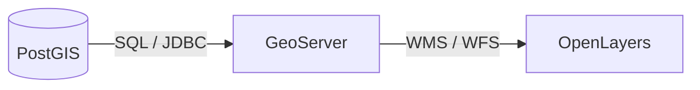

# Module 4 - PostGIS & OpenLayers

Welcome to Module 4. We know how to serve data via GeoServer, but where does GeoServer get its data? For enterprise applications, the answer is almost always **PostgreSQL** with the **PostGIS** extension.

---

## 1. The Architecture Flow

The standard open-source GIS stack flows like this:



1. **PostGIS:** Stores geometries and attributes. Runs spatial queries.
2. **GeoServer:** Connects to PostGIS, translates the data into web services (Images/GeoJSON).
3. **OpenLayers:** Requests and displays the services to the user.

---

## 2. PostGIS Concepts

PostGIS turns a standard PostgreSQL database into a spatial engine. It adds the `geometry` and `geography` data types.

Instead of just querying `SELECT * FROM buildings WHERE city='Paris'`, you can run spatial queries:

```sql
-- Find all buildings within 500 meters of a specific subway station
SELECT b.name, b.geom 
FROM buildings b, stations s
WHERE s.name = 'Central Station'
AND ST_DWithin(b.geom, s.geom, 500);
```

---

## 3. SQL Views in GeoServer

You don't always have to publish raw tables. In GeoServer, you can create an **SQL View**. This allows you to publish a complex PostGIS query as if it were a simple layer. 

For example, you can write a query in GeoServer that groups data, buffers it, or filters it dynamically, and OpenLayers just consumes it as a standard WMS layer!

---

### Practical activity

**Your Task:**

1. Use pgAdmin or DBeaver to connect to the training PostGIS database.
2. Write a simple `SELECT` query to view the `trees` table and observe the `geom` column.
3. Go into the GeoServer admin panel, create a new Store connecting to this database.
4. Publish the `trees` table.
5. In your OpenLayers code, add an `ImageWMS` layer pointing to your newly published `trees` layer.