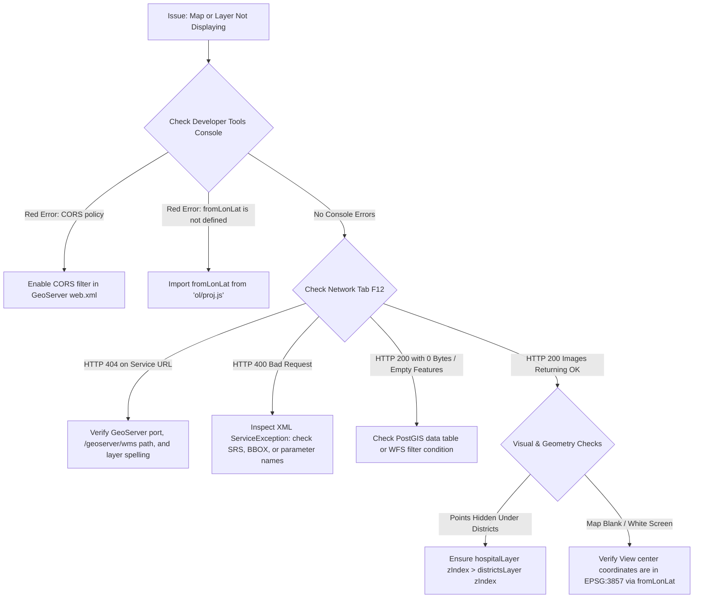

# Module 8 - Integrated Web GIS Application & Final Challenge

Welcome to the capstone module! In this session, you will integrate the concepts mastered across the entire course—OpenLayers architecture, data sources, GeoServer services, PostGIS, vector styling, and feature interactions—to build a complete, production-grade Web GIS application independently.

```text
               ENTERPRISE DATA SOURCES
         ┌──────────────────┴──────────────────┐
         ↓                                     ↓
GeoServer WMS (Districts)             GeoServer WFS (Hospitals)
         │                                     │
         └──────────────────┬──────────────────┘
                            ↓
               OPENLAYERS CLIENT APPLICATION
    ┌───────────────────────┼───────────────────────┐
    ↓                       ↓                       ↓
Base Map (OSM)       Dynamic Styling        Select & Hover
(minZoom constraint) (Capacity > 100)     (Popup & Info Panel)
    │                       │                       │
    └───────────────────────┼───────────────────────┘
                            ↓
                 INTEGRATED WEB GIS UI
```

---

## 1. Project Setup & Architecture

A production Web GIS client separates visual presentation, operational data layers, styling rules, and user interaction handlers into a modular hierarchy.

### 1.1 Component Hierarchy
Every interactive OpenLayers application is structured around a tree of coordinated objects:

```text
HTML Container (#map)
         ↓
OpenLayers Map Instance
 ├── View (EPSG:3857, center, zoom, minZoom, maxZoom)
 ├── Controls (Zoom, Attribution, ScaleLine, FullScreen)
 ├── Overlays (Popup container anchored to coordinates)
 ├── Interactions (Select on click, Hover pointermove)
 └── Layers (Ordered by zIndex)
      ├── Base Layer: OpenStreetMap (TileLayer + OSM, zIndex: 0)
      ├── Operational Layer: Municipal Districts (ImageLayer + ImageWMS, zIndex: 1)
      └── Vector Layer: Healthcare Facilities (VectorLayer + VectorSource, zIndex: 2)
```

### 1.2 Managing Layer Stacking (`zIndex`)

In multi-layer applications, layer visibility conflicts occur when rasters hide vector points. Explicitly setting `zIndex` ensures deterministic rendering:

- `zIndex: 0` $\rightarrow$ Base map (OSM / Satellite).
- `zIndex: 1` $\rightarrow$ Polygon boundary overlays (WMS / Districts).
- `zIndex: 2` $\rightarrow$ Interactive vector points & lines (WFS / Hospitals).

---

## 2. Base Map & View Setup

The map view governs geographic perspective, initial bounds, and navigation constraints.

```javascript
import Map from 'ol/Map.js';
import View from 'ol/View.js';
import TileLayer from 'ol/layer/Tile.js';
import OSM from 'ol/source/OSM.js';
import { fromLonLat } from 'ol/proj.js';

// 1. Base Layer
const baseLayer = new TileLayer({
  source: new OSM(),
  zIndex: 0
});

// 2. View Configuration with Navigation Constraints
const view = new View({
  center: fromLonLat([73.8567, 18.5204]), // Pune, India target coordinates
  zoom: 12,
  minZoom: 6,  // Prevents user from zooming out into global space
  maxZoom: 18  // Prevents over-zooming beyond tile availability
});

const map = new Map({
  target: 'map',
  layers: [baseLayer],
  view: view
});
```

---

## 3. GeoServer WMS Layer Integration

The boundary layer represents territorial districts rendered as a server-side WMS map image.

```javascript
import ImageLayer from 'ol/layer/Image.js';
import ImageWMS from 'ol/source/ImageWMS.js';

const districtsSource = new ImageWMS({
  url: 'http://localhost:8080/geoserver/wms',
  params: {
    'LAYERS': 'training:districts',
    'TRANSPARENT': true,
    'FORMAT': 'image/png'
  },
  serverType: 'geoserver'
});

const districtsLayer = new ImageLayer({
  source: districtsSource,
  opacity: 0.75,
  zIndex: 1 // Sits above OSM base map, below hospital vectors
});

map.addLayer(districtsLayer);
```

### Key Considerations:

- **`TRANSPARENT: true`:** Mandatory so lower base map roads and labels show through district boundaries.
- **Inspect Network Traffic:** Open browser Developer Tools (`F12` $\rightarrow$ **Network**). Pan the map to verify outgoing `GetMap` requests with updated `BBOX` coordinates.

---

## 4. GeoServer WFS & Data-Driven Styling

The healthcare facilities layer is loaded as client-side vector geometries via WFS, enabling dynamic styling based on bed capacity.

```javascript
import VectorLayer from 'ol/layer/Vector.js';
import VectorSource from 'ol/source/Vector.js';
import GeoJSON from 'ol/format/GeoJSON.js';
import { Style, Circle as CircleStyle, Fill, Stroke, Text } from 'ol/style.js';

// 1. Pre-cached Styles for High Performance
const highCapacityStyle = new Style({
  image: new CircleStyle({
    radius: 9,
    fill: new Fill({ color: '#D32F2F' }), // Red for major facilities (> 100 beds)
    stroke: new Stroke({ color: '#FFFFFF', width: 2 })
  })
});

const normalCapacityStyle = new Style({
  image: new CircleStyle({
    radius: 6,
    fill: new Fill({ color: '#1976D2' }), // Blue for standard clinics (<= 100 beds)
    stroke: new Stroke({ color: '#FFFFFF', width: 1.5 })
  })
});

// 2. Attribute-Based Style Function
function hospitalStyleFunction(feature, resolution) {
  const capacity = feature.get('capacity') || 0;
  const baseStyle = capacity > 100 ? highCapacityStyle : normalCapacityStyle;

  // Add text label when zoomed in close (resolution < 25 meters/pixel)
  if (resolution < 25) {
    return new Style({
      image: baseStyle.getImage(),
      text: new Text({
        text: feature.get('name') || '',
        font: 'bold 12px Inter, sans-serif',
        fill: new Fill({ color: '#212121' }),
        stroke: new Stroke({ color: '#FFFFFF', width: 3 }),
        offsetY: -14
      })
    });
  }

  return baseStyle;
}

// 3. WFS Vector Layer
const hospitalSource = new VectorSource({
  format: new GeoJSON(),
  url: 'http://localhost:8080/geoserver/wfs?service=WFS&version=2.0.0&request=GetFeature&typeNames=training:hospitals&outputFormat=application/json'
});

const hospitalLayer = new VectorLayer({
  source: hospitalSource,
  style: hospitalStyleFunction,
  zIndex: 2 // Rendered on top of district polygons
});

map.addLayer(hospitalLayer);
```

---

## 5. Feature Interaction & Attribute Display

Users expect instant feedback when clicking features. You can present attributes through an **external info panel** or a coordinate-anchored **`ol/Overlay` popup**.

```javascript
import Select from 'ol/interaction/Select.js';
import { click } from 'ol/events/condition.js';

// 1. Configure Selection Interaction with Hit Tolerance
const selectInteraction = new Select({
  condition: click,
  layers: [hospitalLayer],
  hitTolerance: 5, // Pixel buffer around touch/click for mobile friendliness
  style: new Style({
    image: new CircleStyle({
      radius: 12,
      fill: new Fill({ color: '#FFD600' }), // Highlight gold
      stroke: new Stroke({ color: '#000000', width: 2.5 })
    })
  })
});
map.addInteraction(selectInteraction);

// 2. Output Properties to External HTML Info Panel
const infoPanel = document.getElementById('feature-details');

selectInteraction.on('select', (event) => {
  const selected = event.selected;

  if (selected.length > 0) {
    const props = selected[0].getProperties();
    infoPanel.innerHTML = `
      <h3>${props.name || 'Unnamed Facility'}</h3>
      <p><strong>Capacity:</strong> ${props.capacity} beds</p>
      <p><strong>District:</strong> ${props.district || 'N/A'}</p>
      <p><strong>Emergency:</strong> ${props.emergency ? 'Available' : 'No'}</p>
    `;
  } else {
    infoPanel.innerHTML = '<p class="placeholder">Click a hospital to inspect details.</p>';
  }
});
```

---

## 6. Controls & Map UI Polishing

OpenLayers ships with essential map controls that improve user orientation and usability.

```javascript
import ScaleLine from 'ol/control/ScaleLine.js';
import FullScreen from 'ol/control/FullScreen.js';
import { defaults as defaultControls } from 'ol/control/defaults.js';

// Add ScaleLine and FullScreen to map controls
map.addControl(new ScaleLine({ units: 'metric' }));
map.addControl(new FullScreen());
```

---

## 7. Systematic Troubleshooting & Debugging

When building multi-tier GIS applications, use this diagnostic checklist before requesting assistance:



### Top 5 Common Pitfalls:

- **Coordinate Misprojection:** Passing raw latitude/longitude degrees `[73.85, 18.52]` directly to `new View({ center: ... })` without calling `fromLonLat([73.85, 18.52])`. The map centers in the Atlantic Ocean off the coast of Africa.
- **Missing `ol.css`:** Forgetting `import 'ol/ol.css';` causes map controls, zoom buttons, and attribution text to appear as broken, stacked text in the corner of the screen.
- **CORS Violations:** Browsers blocking WFS GeoJSON requests from `http://localhost:5173` to `http://localhost:8080` because GeoServer CORS filter is commented out.
- **Z-Index Inversion:** Adding `hospitalLayer` before `districtsLayer` without explicit `zIndex` values, causing the opaque district polygons to cover the hospital markers.
- **WFS Version Parameter:** WFS 2.0 uses `typeNames` and `count`, whereas WFS 1.1 uses `typeName` and `maxFeatures`. Mixing these parameters can return empty XML.

---

### Reference resources

- **OpenLayers Core API Reference:** [https://openlayers.org/en/latest/apidoc/](https://openlayers.org/en/latest/apidoc/)
- **OpenLayers Official Examples Catalog:** [https://openlayers.org/en/latest/examples/](https://openlayers.org/en/latest/examples/)
- **GeoServer Web Map Service (WMS) Reference:** [https://docs.geoserver.org/latest/en/user/services/wms/](https://docs.geoserver.org/latest/en/user/services/wms/)
- **GeoServer Web Feature Service (WFS) Reference:** [https://docs.geoserver.org/latest/en/user/services/wfs/](https://docs.geoserver.org/latest/en/user/services/wfs/)
- **MDN Web Docs — Developer Tools Network Tab:** [https://developer.mozilla.org/en-US/docs/Learn_web_development/Howto/Solve_HTML_problems/Cross_network_debugging](https://developer.mozilla.org/en-US/docs/Learn_web_development/Howto/Solve_HTML_problems/Cross_network_debugging)

---

### Practical activity

**Your Task:**

#### Core Challenge
Build the application independently using the requirements below. You may refer to the OpenLayers API documentation and your previous module examples. Use Developer Tools to troubleshoot issues before asking for help.

1. **Base Map & Constraints:**
   - Initialize an OpenLayers map in `#map`.
   - Set the `View` projection to `EPSG:3857`.
   - Center the map over your study region using `fromLonLat([lon, lat])`.
   - Enforce navigation limits using `minZoom: 6` and `maxZoom: 18`.
   - Add an OpenStreetMap `TileLayer` as the base layer (`zIndex: 0`).

2. **GeoServer WMS Districts Layer:**
   - Add an `ImageLayer` powered by `ImageWMS` connecting to GeoServer (`http://localhost:8080/geoserver/wms`).
   - Request the `training:districts` layer with `TRANSPARENT: true`.
   - Set `zIndex: 1` so the district boundaries sit above OSM but below point features.

3. **GeoServer WFS Hospitals Layer & Dynamic Styling:**
   - Add a `VectorLayer` consuming the `training:hospitals` layer via WFS as GeoJSON.
   - Implement a dynamic style function:
     - If `capacity > 100`: Render a **Red** circle marker (radius: 8).
     - Otherwise: Render a **Blue** circle marker (radius: 6).
   - Set `zIndex: 2`.

4. **Interactive Feature Selection:**
   - Add a `Select` interaction configured to trigger on `click`.
   - When a hospital is selected, extract its properties (`name`, `capacity`, `district`) and render them inside an HTML info panel outside the map.

5. **Map Controls:**
   - Add a visible `ScaleLine` control with metric units.
   - Add a `FullScreen` control button.

---

#### Extension Challenge
Once the core application is working, choose any **two** extension tasks below and implement them:

- **Option A — Interactive Hover Effect:** Add a `pointermove` listener that changes the browser cursor to `'pointer'` and applies a cyan highlight stroke when hovering over a hospital.
- **Option B — Coordinate Popup Overlay:** Replace the external info panel with an `ol/Overlay` popup card anchored directly over the clicked hospital's coordinates.
- **Option C — Hospital Capacity Legend:** Build an HTML legend card in the corner of the map displaying the red (> 100 beds) and blue (<= 100 beds) symbology keys.
- **Option D — Dynamic CQL Filter:** Add an HTML `<input>` or dropdown that dynamically applies a `CQL_FILTER` (e.g., `capacity >= 150`) to the layer without reloading the page.
- **Option E — Layer Visibility Switcher:** Add UI checkboxes that toggle the visibility of the Districts and Hospitals layers independently (`layer.setVisible()`).
- **Option F — Live Feature Counter:** Display a badge in the UI header showing the total number of hospital features currently loaded in the `VectorSource`.

---

#### Example Implementation (`main.js` and `index.html`):

##### HTML Layout (`index.html`):
```html
<!DOCTYPE html>
<html lang="en">
<head>
  <meta charset="UTF-8">
  <title>City Healthcare GIS Portal</title>
  <link rel="stylesheet" href="./style.css">
</head>
<body>
  <header class="app-header">
    <h1>City Healthcare GIS Portal</h1>
    <div id="feature-counter" class="badge">Loading features...</div>
  </header>

  <div class="main-container">
    <div id="map" class="map-view"></div>
    
    <aside class="sidebar">
      <h2>Facility Information</h2>
      <div id="feature-details">
        <p class="placeholder">Click any hospital marker on the map to inspect details.</p>
      </div>

      <div class="legend">
        <h3>Symbology</h3>
        <div class="legend-item"><span class="dot red"></span> Major Hospital (&gt; 100 beds)</div>
        <div class="legend-item"><span class="dot blue"></span> Standard Clinic (&le; 100 beds)</div>
      </div>
    </aside>
  </div>

  <script type="module" src="./main.js"></script>
</body>
</html>
```

##### Application Logic (`main.js`):
```javascript
import Map from 'ol/Map.js';
import View from 'ol/View.js';
import TileLayer from 'ol/layer/Tile.js';
import ImageLayer from 'ol/layer/Image.js';
import VectorLayer from 'ol/layer/Vector.js';
import OSM from 'ol/source/OSM.js';
import ImageWMS from 'ol/source/ImageWMS.js';
import VectorSource from 'ol/source/Vector.js';
import GeoJSON from 'ol/format/GeoJSON.js';
import Select from 'ol/interaction/Select.js';
import ScaleLine from 'ol/control/ScaleLine.js';
import FullScreen from 'ol/control/FullScreen.js';
import { click } from 'ol/events/condition.js';
import { Style, Circle as CircleStyle, Fill, Stroke, Text } from 'ol/style.js';
import { fromLonLat } from 'ol/proj.js';
import 'ol/ol.css';

// 1. Base Layer (OSM)
const baseLayer = new TileLayer({
  source: new OSM(),
  zIndex: 0
});

// 2. Operational WMS Layer: Districts
const districtsLayer = new ImageLayer({
  source: new ImageWMS({
    url: 'http://localhost:8080/geoserver/wms',
    params: {
      'LAYERS': 'training:districts',
      'TRANSPARENT': true,
      'FORMAT': 'image/png'
    },
    serverType: 'geoserver'
  }),
  opacity: 0.7,
  zIndex: 1
});

// 3. Dynamic Styles for Healthcare Facilities
const majorHospitalStyle = new Style({
  image: new CircleStyle({
    radius: 9,
    fill: new Fill({ color: '#D32F2F' }),
    stroke: new Stroke({ color: '#FFFFFF', width: 2 })
  })
});

const standardClinicStyle = new Style({
  image: new CircleStyle({
    radius: 6,
    fill: new Fill({ color: '#1976D2' }),
    stroke: new Stroke({ color: '#FFFFFF', width: 1.5 })
  })
});

function hospitalStyleFunction(feature, resolution) {
  const capacity = feature.get('capacity') || 0;
  const baseStyle = capacity > 100 ? majorHospitalStyle : standardClinicStyle;

  if (resolution < 30) {
    return new Style({
      image: baseStyle.getImage(),
      text: new Text({
        text: feature.get('name') || '',
        font: 'bold 12px Inter, sans-serif',
        fill: new Fill({ color: '#1A1A1A' }),
        stroke: new Stroke({ color: '#FFFFFF', width: 3 }),
        offsetY: -14
      })
    });
  }

  return baseStyle;
}

// 4. Vector WFS Layer: Hospitals (with fallback GeoJSON for training)
const hospitalSource = new VectorSource({
  format: new GeoJSON(),
  url: 'http://localhost:8080/geoserver/wfs?service=WFS&version=2.0.0&request=GetFeature&typeNames=training:hospitals&outputFormat=application/json'
});

const hospitalLayer = new VectorLayer({
  source: hospitalSource,
  style: hospitalStyleFunction,
  zIndex: 2
});

// Update feature counter when WFS features load
hospitalSource.on('featuresloadend', () => {
  const count = hospitalSource.getFeatures().length;
  const counterEl = document.getElementById('feature-counter');
  if (counterEl) {
    counterEl.textContent = `${count} facilities loaded`;
  }
});

// 5. Map Initialization
const map = new Map({
  target: 'map',
  layers: [baseLayer, districtsLayer, hospitalLayer],
  view: new View({
    center: fromLonLat([73.8567, 18.5204]),
    zoom: 12,
    minZoom: 6,
    maxZoom: 18
  })
});

// 6. Map Controls
map.addControl(new ScaleLine({ units: 'metric' }));
map.addControl(new FullScreen());

// 7. Interactive Feature Selection
const select = new Select({
  condition: click,
  layers: [hospitalLayer],
  hitTolerance: 5,
  style: new Style({
    image: new CircleStyle({
      radius: 12,
      fill: new Fill({ color: '#FFD600' }),
      stroke: new Stroke({ color: '#212121', width: 2.5 })
    })
  })
});
map.addInteraction(select);

const infoPanel = document.getElementById('feature-details');
select.on('select', (event) => {
  if (event.selected.length > 0) {
    const props = event.selected[0].getProperties();
    infoPanel.innerHTML = `
      <h3 style="margin-top:0; color:#1976D2;">${props.name || 'Healthcare Facility'}</h3>
      <p><strong>Bed Capacity:</strong> ${props.capacity || 'N/A'}</p>
      <p><strong>District:</strong> ${props.district || 'Municipal Zone'}</p>
      <p><strong>Emergency Unit:</strong> ${props.emergency ? 'Available 24/7' : 'Standard Hours'}</p>
    `;
  } else {
    infoPanel.innerHTML = '<p class="placeholder">Click any hospital marker on the map to inspect details.</p>';
  }
});

// 8. Hover Pointer Feedback
map.on('pointermove', (evt) => {
  if (evt.dragging) return;
  const hit = map.hasFeatureAtPixel(evt.pixel, {
    layerFilter: (candidate) => candidate === hospitalLayer,
    hitTolerance: 3
  });
  map.getTargetElement().style.cursor = hit ? 'pointer' : '';
});
```